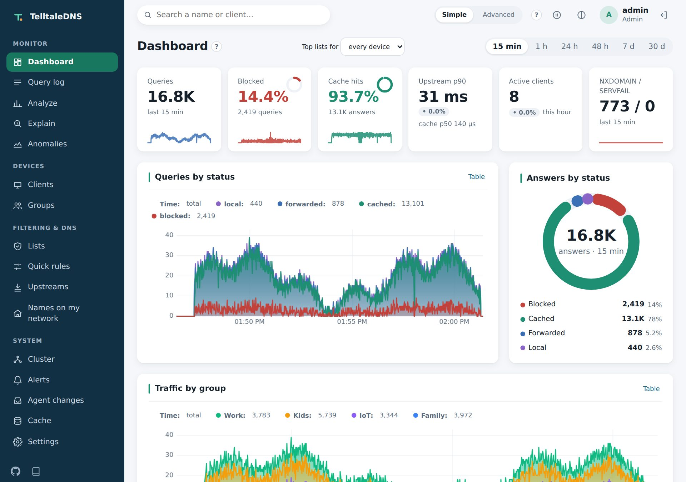

# TelltaleDNS

[](https://github.com/paimonsoror/telltaledns/actions/workflows/ci.yml?query=branch%3Amain)
[](https://github.com/paimonsoror/telltaledns/releases/latest)
[](#license)

**See every question. Answer on your terms.**

Every connection on your network starts with a DNS lookup. TelltaleDNS answers it in microseconds, filters it by your rules per device, and shows you exactly who asked, what they asked, and why it answered the way it did. It runs on a Raspberry Pi, in Kubernetes, or on both as one cluster that keeps answering even when parts of it fail.

> A *telltale* is the strip of yarn sailors tie to a sail to see what the wind is really doing. DNS is your network's telltale: it reveals what every device is up to.

<p align="center">
  <picture>
    <source media="(prefers-color-scheme: dark)" srcset="docs/images/dashboard-dark.jpg">
    
  </picture>
  <br>
  <sub>The dashboard on a demo network. Every device, name, and address in it is made up.</sub>
</p>

## Mission
Give everyone who runs a home or small network an honest, real-time view of what their devices are doing, and full control over it, without trading away speed, footprint, or reliability.

- **See:** every query is attributed to a device, explained, and timed per stage.
- **Decide:** your rules per device and group, enforced instantly at no performance cost.
- **Never fail:** DNS keeps answering from its last good config, whatever happens to the control plane.
- **Run anywhere:** the same artifact on a Pi, in a cluster, or both at once.

## What it does
- **Every answer explained.** The query log ties each query to a named device, times every stage, and says why it was answered that way. Names come from your router, from what devices announce over mDNS, or from the UI.
- **Your rules, per device.** Blocklists, groups for each network or VLAN, schedules, safe search, blocked services, rewrites, and quick rules.
- **Encrypted both ways.** DoT, DoH, and DoQ for your devices and to your upstreams, DNSSEC validation, and full recursion when you'd rather not forward at all.
- **Watch it work.** A dashboard for the whole cluster, one node, or one site; device anomalies and alerts; Prometheus metrics, OpenTelemetry, dnstap, and event sinks for your SIEM.
- **One cluster, many places.** A Pi and Kubernetes nodes share one config and one management plane. A witness lets a replica take over automatically, and the config can live in Git.
- **Private by design.** Privacy levels decide how much of each query is kept, from everything to counters only, and every change lands in an audit log.
- **Ready for agents.** A documented REST API with OpenAPI, `telltale ctl` for the shell, and MCP tools with plans and approval for AI agents.
- **Small.** One static binary in an image of about 11 MiB, for amd64, arm64, and 32-bit Pi OS, with signed releases.

## Quick start
On a Raspberry Pi or any Linux host with Docker:
```sh
mkdir telltale && cd telltale
curl -fsSLO https://raw.githubusercontent.com/paimonsoror/telltaledns/main/deploy/compose/compose.yaml
curl -fsSLO https://raw.githubusercontent.com/paimonsoror/telltaledns/main/deploy/compose/telltale.toml
docker compose up -d
docker compose exec telltale telltale auth setup-token     # then open http://<host>:8053/
```
Kubernetes (Helm), a native systemd install, clustering, and moving from Pi-hole or Technitium are covered in [`docs/running.md`](docs/running.md).

**Status:** pre-1.0. Tagged [releases](https://github.com/paimonsoror/telltaledns/releases) are stable (`latest`), and `edge` is built from every commit on `main`. Releases before 1.0 can still change configuration keys and APIs, and their notes call out every such change; the [roadmap](spec/10-roadmap-and-tasks.md) shows what's next. Project site: **https://paimonsoror.github.io/telltaledns/**

| Read this | If you want |
|---|---|
| [`EXECUTIVE-SUMMARY.md`](EXECUTIVE-SUMMARY.md) | What TelltaleDNS is built around, and the projects that inspired it |
| [`docs/analysis.md`](docs/analysis.md) | Design notes: what we learned from Pi-hole and Technitium |
| [`spec/`](spec/00-overview.md) | The build specification (requirements, architecture, ADRs, roadmap) |
| [`AGENTS.md`](AGENTS.md) | Instructions for the agent or developer implementing it |

## Spec index
0. [Overview](spec/00-overview.md): vision, goals, release-gate metrics
1. [Requirements](spec/01-requirements.md): numbered P0/P1/P2 contract
2. [Architecture](spec/02-architecture.md): roles, crates, threading, data flow
3. [Resolution pipeline](spec/03-resolution-pipeline.md): listeners, cache, DNSSEC, recursion
4. [Upstreams](spec/04-upstreams.md): protocols, presets, strategies, custom plugins
5. [Filtering](spec/05-filtering.md): list syntax, FST/DFA snapshots, groups, schedules
6. [Observability](spec/06-observability.md): QueryEvent, metrics, query-log store, analytics
7. [API and UI](spec/07-api-and-ui.md)
8. [Deployment, config, security](spec/08-deployment-config-security.md): Helm, Pi, auth (local + OIDC)
9. [Testing and benchmarks](spec/09-testing-and-benchmarks.md)
10. [Roadmap and tasks](spec/10-roadmap-and-tasks.md)
11. [Decisions (ADRs)](spec/11-decisions.md)
12. [Clustering and HA](spec/12-clustering-and-ha.md)
13. [Agent API and MCP](spec/13-agent-api-and-mcp.md)

## License
Licensed under either of [Apache License 2.0](LICENSE-APACHE) or [MIT](LICENSE-MIT), at your option.
