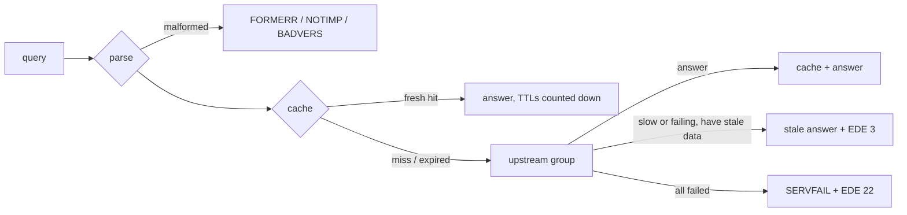

# Running TelltaleDNS

> **Status:** early development. TelltaleDNS resolves queries over UDP and TCP through plain or encrypted upstreams (`udp://`, `tcp://`, `tls://` DoT, `https://` DoH over HTTP/2), with caching, failover, and serve-stale. Filtering and the web UI arrive in the next milestones (`spec/10-roadmap-and-tasks.md`).

## Start
```sh
telltale run                         # uses $TELLTALE_CONFIG, else /etc/telltale/telltale.toml, else defaults
telltale run -c telltale.toml        # explicit config file(s); later files override earlier ones
```
A minimal working config:
```toml
[[listen]]
proto = "udp"
addr = "127.0.0.1:5300"

[[listen]]
proto = "tcp"
addr = "127.0.0.1:5300"

[[upstream]]
name = "cloudflare"
url = "udp://1.1.1.1"

[[upstream]]
name = "quad9"
url = "udp://9.9.9.9"

[[upstream_group]]
name = "default"          # queries that match no route use this group
members = ["cloudflare", "quad9"]
strategy = "fastest"      # failover | round_robin | weighted | fastest | parallel
```
```sh
telltale run -c dev.toml
dig @127.0.0.1 -p 5300 example.com
```
Defaults without `[[listen]]`: UDP and TCP port 53 on `0.0.0.0` and `[::]`, with one worker thread per available CPU (container CPU limits are respected). Ports below 1024 need root or `CAP_NET_BIND_SERVICE`. DoT and DoH listeners are described in "Encrypted DNS for your devices"; DoQ and DoH3 listeners are accepted in config but skipped with a warning.

## Container image
`ghcr.io/paimonsoror/telltale:edge` is built from every commit on `main` for `linux/amd64`, `linux/arm64` (Raspberry Pi 3/4/5 with a 64-bit OS), and `linux/arm/v7` (32-bit Pi OS). It contains one static binary, CA certificates, and time-zone data, about 3 MiB compressed, with no shell. It runs as user `65532:65532`. Versioned tags (`:1`, `:1.2.3`) start with the first release.
```sh
docker run -d --name telltale --restart unless-stopped \
  --read-only --cap-drop ALL --security-opt no-new-privileges \
  -p 53:53/udp -p 53:53/tcp -p 9153:9153 \
  -v "$PWD/telltale.toml:/etc/telltale/telltale.toml:ro" \
  -v telltale-data:/var/lib/telltale \
  ghcr.io/paimonsoror/telltale:edge
```
- The config is read from `/etc/telltale/telltale.toml` when it exists; otherwise the built-in defaults apply. `/var/lib/telltale` is the only path written to.
- With `-p` (bridge networking), port 53 works with every capability dropped: Docker lets unprivileged users bind low ports inside the container's own network namespace.
- With `--network host` (useful on a Pi, so the logs show real client addresses), that exception doesn't apply. Let unprivileged users bind port 53 on the host:
  ```sh
  echo 'net.ipv4.ip_unprivileged_port_start=53' | sudo tee /etc/sysctl.d/50-telltale.conf && sudo sysctl --system
  ```
  Alternatively, run the container as root with only that one capability: `--user 0:0 --cap-drop ALL --cap-add NET_BIND_SERVICE`. Adding `NET_BIND_SERVICE` while running as `65532` doesn't work, because Docker doesn't pass added capabilities to non-root users.
- Reload with `docker kill -s HUP telltale`; stop with `docker stop` (a graceful drain, see [Stop](#stop)).

Build it yourself with `docker buildx build -t telltale:dev .` (add `--platform linux/amd64,linux/arm64,linux/arm/v7` for all three). The build cross-compiles, so it doesn't need QEMU.

## Raspberry Pi and Linux
Two ways, both with real client addresses (host networking) and port 53 without running as a full root process. Pi 3, 4, 5, and Zero 2 W are supported (64-bit or 32-bit OS); ARMv6 boards (Pi 1, Zero W) aren't.

**Docker Compose (recommended):** `deploy/compose/` has `compose.yaml` and a starter `telltale.toml` (encrypted upstreams, one balanced blocklist, a 7-day query log).
```sh
mkdir telltale && cd telltale
curl -fsSLO https://raw.githubusercontent.com/paimonsoror/telltaledns/main/deploy/compose/compose.yaml
curl -fsSLO https://raw.githubusercontent.com/paimonsoror/telltaledns/main/deploy/compose/telltale.toml
docker compose up -d
docker compose exec telltale telltale auth setup-token     # then open http://<pi>:8053/
```
The container uses the host network, a read-only root filesystem, and only `NET_BIND_SERVICE`, as root inside the container by default. To run it as the image's unprivileged user, set `net.ipv4.ip_unprivileged_port_start=53` on the host (`echo net.ipv4.ip_unprivileged_port_start=53 | sudo tee /etc/sysctl.d/50-telltale.conf && sudo sysctl --system`) and switch `user:` in `compose.yaml`. Updates: `docker compose pull && docker compose up -d`. Reload the config without a restart: `docker compose kill -s HUP`.

**Native (systemd):** `deploy/systemd/install.sh` downloads the static binary for your CPU, checks the release signature (minisign) and its SHA-256, creates a `telltale` system user, installs a sandboxed systemd unit (`ProtectSystem=strict`, only `CAP_NET_BIND_SERVICE`, `MemoryMax=256M`) and the starter config (an existing `/etc/telltale/telltale.toml` is kept), then starts the service and waits until it's ready.
```sh
curl -fsSLO https://raw.githubusercontent.com/paimonsoror/telltaledns/main/deploy/systemd/install.sh
less install.sh                     # read before running as root
sudo sh install.sh --edge           # builds from main; without --edge: the latest tagged release
sudo -u telltale telltale auth setup-token -c /etc/telltale/telltale.toml
```
**Guided setup.** Run in a terminal on a new machine, the installer asks one question first: press Enter for the recommended settings (the starter config above), or choose **Walk me through the options**. Each step shows its default in `[brackets]`; Enter or `skip` keeps it:
1. **Builds:** releases or edge.
2. **Upstreams:** Cloudflare and Quad9 (encrypted, the default), one provider (Cloudflare, Quad9, Google, Mullvad, AdGuard), plain DNS for networks that block port 853, or your own server.
3. **Starting blocklists:** one or more of HaGeZi Pro (the default), Light, Pro++, Threat Intelligence, Steven Black's hosts, and OISD small, or none (add lists later on the Lists page).
4. **Where DNS listens:** every address, or one.
5. **systemd-resolved:** turn its stub listener off if it holds port 53.
6. **The first admin:** a setup token for the web UI (the default), or a username and password now.
7. **The query log:** how many days to keep, and how much it records (privacy level 0 to 3).

A summary comes before anything is installed. The answers become `/etc/telltale/telltale.toml`, checked with `telltale config check` before the service starts.
- **No questions** when stdin isn't a terminal (`curl … | sh`, automation), with `--yes`, or when `/etc/telltale/telltale.toml` already exists (re-runs only upgrade).
- **Automation:** `--interactive` asks even without a terminal and reads the answers from stdin; `--config-only FILE` writes the config and stops (no root needed), to see what the answers produce.
- **The first admin "now"** is created on the service's first start from an Argon2id hash in a root-only systemd drop-in, which the installer removes once the service is up. The password itself isn't stored.

Re-running it upgrades the binary in place. `sudo telltale self-update --restart` does the same check-and-swap from the binary itself (`--channel edge` for builds from main, `--check` to only look): it verifies the signature with the release key built into the binary and the binary's SHA-256, test-runs the download, swaps it in atomically, and keeps the previous binary as `telltale.old`. In containers it refuses (pull a new image instead).

**Port 53 already in use:** on Ubuntu and some Debian setups, systemd-resolved's stub listener holds `127.0.0.53:53`. `install.sh` offers to turn it off (`--disable-resolved-stub` does it without asking: the machine then resolves through TelltaleDNS); for Compose, add `DNSStubListener=no` under `[Resolve]` in `/etc/systemd/resolved.conf.d/telltale.conf` and `sudo systemctl restart systemd-resolved`. Alternatively listen on the LAN address only with `[[listen]]`. Pi-hole or another resolver on the same machine must be stopped first.

**Small Pis and SD cards:** the query log writes continuously; keep `[telemetry.qlog] retention_days` short (the starter config uses 7) or put `/var/lib/telltale` on a USB SSD. On a Pi Zero 2 W (512 MB) also set `[node] workers = 2` and `[cache] max_bytes = "16MiB"`, and prefer smaller blocklists.

Then point your router's DHCP DNS server setting at the Pi's address so every device uses it.

## Moving from Pi-hole
`telltale import pihole PATH -o pihole.toml` turns a Pi-hole setup into TelltaleDNS configuration. PATH is a Teleporter export (Settings → Teleporter → Export: a `.zip` from Pi-hole v6, a `.tar.gz` from v5), a `gravity.db`, or a copy of `/etc/pihole`. The output is checked to load before it's written.

| Pi-hole | TelltaleDNS |
|---|---|
| Upstream DNS servers (`IP#port`) | `[[upstream]]` `pihole-N` in the `default` upstream group, strategy `fastest` (Pi-hole also prefers the fastest server) |
| Conditional forwarding (rev servers) | an upstream, an upstream group, and a `[[route]]` for the local domain and every reverse zone of the network (a /23 is two /24 zones), with a DNSSEC negative trust anchor |
| Local DNS records, CNAME records | `[[record]]` A/AAAA and CNAME (with the CNAME's TTL) |
| Adlists (`https://`, `file://`) | `[[list]]` named `pihole-<id>-<file>`, with `url` or `path`; switched-off ones stay with `enabled = false`; v6 allowlists become `kind = "allow"` |
| Allowed / denied domains, exact and regex | inline lists `pihole-allow-exact`, `pihole-deny-regex`, ..., one per set of groups. Exact entries match only that name (`match = "exact"`). Regexes keep `;querytype=` and `;invert` |
| Groups (Default → `default`) | `[[group]]` with exactly the lists Pi-hole gave it. A switched-off group gets no lists |
| Clients (IP, CIDR, MAC) | `[[client]]` named by the Pi-hole comment, in the same groups. Clients in no group (nothing is blocked for them in Pi-hole) go to `pihole-no-group`, which has no lists |
| DHCP reservations | named devices: the MAC and IP join a matching client, or become a new one named by the host name |
| DNSSEC, rate limit, blocking mode (NULL, NXDOMAIN, NODATA) | `[dnssec] mode = "validate"`, `[ratelimit]`, each group's `block_mode` |

The header lists what has no equivalent, by setting name (values, such as password hashes, are never copied):
- clients matched by host name or network interface (add their IP or MAC instead);
- the DHCP server itself (keep DHCP on your router or on Pi-hole for now);
- privacy level, web-server, and other Pi-hole-only settings. From v6, only settings marked as changed from their defaults are listed;
- the `IP` blocking modes, entries switched off, and domain entries our regex engine can't run (backreferences and lookaround).

Query history, the admin password, and API tokens aren't imported. The output is a complete starting configuration: on a fresh install, use it as is next to your node settings (`telltale run -c telltale.toml -c pihole.toml`). Into an existing one, merge by hand: both define the `default` upstream group and group. Upstreams on the Pi-hole machine itself (`127.0.0.1#5335`, usually unbound) are flagged: keep that resolver running next to TelltaleDNS (a built-in recursive resolver is on the post-1.0 list). CI imports real exports from the official Pi-hole v6 and v5 images and checks the answers (`deploy/pihole-import-e2e.sh`).

## Moving from Technitium
`telltale import technitium http://192.168.1.2:5380 -o technitium.toml` reads a running Technitium DNS Server through its API and writes TelltaleDNS configuration. In Technitium, create an API token (Administration → Sessions → Create Token). Pass it in `TECHNITIUM_TOKEN`, or in a file with `--token-file`; it's never a command-line argument, so it doesn't show up in `ps`. The output is checked to load before it's written, and the token never appears in it.

| Technitium | TelltaleDNS |
|---|---|
| Forwarders (UDP, TCP, TLS, HTTPS; `name (ip:port)` pins the address) | `[[upstream]]` `technitium-N` in the `default` group; concurrent forwarding becomes `parallel` with the same fan-out |
| Primary zones | `[[record]]` A, AAAA, CNAME, PTR, TXT, MX, SRV, with their TTLs (SOA and apex NS aren't needed) |
| Forwarder zones (conditional forwarding) | upstreams by priority, a group, and a `[[route]]` for the zone. A negative trust anchor applies unless every forwarder of the zone validated |
| Block list URLs (`!` = allow list), blocked and allowed zones | `[[list]]`; the zones become inline lists `technitium-blocked` / `technitium-allowed` (subtree, like Technitium) |
| Blocking type (NXDOMAIN, custom address) | each group's `block_mode` |
| Advanced Blocking app groups | `[[group]]` with the group's URL lists (shared when groups use the same URL), names, and regexes. The group for `0.0.0.0/0` becomes `default`; other networks become the group's `networks`. Server-wide lists apply to every group |
| Blocking bypass list | a `technitium-bypass` group with those networks and no lists |
| DHCP reservations | named devices (MAC and IP) |
| DNSSEC validation, per-address rate limit, saving the cache | `[dnssec]`, `[ratelimit]` (queries per minute), `[cache] persist` |

The header lists what isn't imported:
- secondary and stub zones;
- QUIC forwarders;
- forwarders given only by name;
- record types we don't serve locally;
- groups chosen by listener or DoH host name;
- per-list blocking answers;
- the DHCP server;
- encrypted listeners (set them up under Encrypted DNS for your devices);
- recursion ACLs, TSIG, zone transfers, the outgoing proxy, and other apps.

Technitium's backup files use a private binary format, so the importer reads the documented API instead (ADR-062). CI runs it against the official Technitium image (`deploy/technitium-import-e2e.sh`).

## Versions and updates
Every build says exactly what it is, the same way on every architecture:
```
$ telltale --version
telltale 0.1.0-edge.64 (commit 3f46fd4, built 2026-10-05T12:00:00Z, channel edge, aarch64-unknown-linux-musl)
```

**Version formats:**
- releases are `0.1.0`;
- builds of `main` are `0.1.0-edge.<run>`;
- a local build is `dev` with its commit.

The same build identity, and how the node was installed (`native`, `container`, or `helm`), shows in the web UI's sidebar and **Settings → System → Version and updates**, in `GET /api/v1/system/info` (`build`, `update`), in `telltale_build_info{version,commit,channel,target}`, and on the Cluster page for every node.

**Update checks:**
- **How:** once a day, a node reads its channel's `releases.json` (published with every release, signed with the release key) and compares versions: `up_to_date`, `available`, `newer` (a dev build), or `unknown` (not checked yet, or failing). An index whose signature doesn't verify is ignored.
- **When:** a minute after the node starts, then every 24 hours (an hour after a failed check). To look now, an admin clicks **Check now** under **Settings → System → Version and updates** (`POST /api/v1/system/update-check`). It's handy on the edge channel, which publishes several builds a day. Clicks less than a minute apart show the last result without fetching again. Nothing is installed.
- **Where it shows:** an **update** pill next to the version in the sidebar, the Version and updates panel (with the step for your install), the Cluster page (each node's version), and `telltale_update_available` (1 when an update exists).
- **Air-gapped:** `[updates] check = false` means nothing leaves the node; `[updates] index_url` points at a mirror (still verified with the built-in key).

TelltaleDNS never updates itself from the UI. The panel shows the step for your install:
- **Native:** `sudo telltale self-update --restart` (`--channel edge` for edge).
- **Container:** `docker compose pull && docker compose up -d`.
- **Helm:** `helm upgrade`, or bump the chart version in your GitOps values.

In a cluster, upgrade replicas first.

## Backups and moving to a new machine
```sh
telltale backup create -o pi.ttbk               # safe while TelltaleDNS runs
telltale backup create --include-qlog -o pi.ttbk # also the query log (can be large)
telltale backup show pi.ttbk                     # check it and list what's in it
telltale backup restore pi.ttbk                  # on the new machine, TelltaleDNS stopped
```
Admins can also download one in the web UI (**Settings → System → Download a backup**) or with `GET /api/v1/backup`. Each download is recorded in the audit log as `backup.create`. Downloads leave out the query log; use the command for that.

**In a backup:**
- the config files the node was started with;
- users (password hashes, two-factor secrets) and API tokens;
- devices, names, and forwarded domains made in the UI;
- the audit log, statistics history, and anomaly baselines;
- the query log, with `--include-qlog`.

**Left out:**
- sign-in sessions (everyone signs in again);
- downloaded lists, compiled snapshots, and the cache, which are rebuilt;
- the cluster identity and its CA key. A restored cluster member starts on its own: run `telltale cluster init` or join it again.

The file is zstd-compressed tar with a manifest of BLAKE3 checksums, written owner-only (`0600`); keep it private.

**Restore:**
- Every file is checked before anything is written, so a damaged or truncated backup changes nothing.
- Existing files are only replaced with `--force`.
- Data goes back to the directory it came from, or `--data-dir`. Config files go back where they were, or `--config-dir`.
- It refuses while TelltaleDNS is running on that data directory (it can't take the directory's lock): stop the service first.
- Files are given the data directory's owner, so a restore run as root works for the `telltale` service user.
- If you restore into a different data directory, the restored config still names the old one: restore says so, and you set `data_dir` (or add a small file that does).

## Kubernetes (Helm)
The chart is published with every release as an OCI artifact (k8s 1.26+, amd64 and arm64).
Use a release version, or `0.1.0-edge.<n>` builds that follow `main`. Its source is in
`deploy/helm/telltale`, and `helm install telltale deploy/helm/telltale` from a checkout works too:
```sh
helm install telltale oci://ghcr.io/paimonsoror/charts/telltale --version <version> \
  -n telltale --create-namespace \
  --set service.dns.annotations."metallb\.universe\.tf/loadBalancerIPs"=192.168.1.53
kubectl -n telltale get svc telltale-dns          # EXTERNAL-IP: point clients (DHCP) here
```
**Every option** is in the chart's commented values file:
`helm show values oci://ghcr.io/paimonsoror/charts/telltale --version <version> > values.yaml`
(or [`deploy/helm/telltale/values.yaml`](../deploy/helm/telltale/values.yaml); the site's
[Helm values](https://paimonsoror.github.io/telltaledns/helm-values.html) page lists each key
with its default). Keep only what you change in your own file and install with `-f my-values.yaml`;
the chart's schema rejects a mistyped value with its path.
- **One LoadBalancer Service, UDP and TCP 53**, with `externalTrafficPolicy: Local` so the query log and per-device rules see real client addresses (verified in CI: a query through the LoadBalancer is logged with the sender's address). `Cluster` hides clients behind node addresses, and the install notes warn about it. Use your LB's annotation for a fixed IP: MetalLB `metallb.universe.tf/loadBalancerIPs`, Cilium `io.cilium/lb-ipam-ips`, kube-vip `kube-vip.io/loadbalancerIPs`.
- **`hostNetwork: true`** answers on port 53 of the node itself (no LoadBalancer, MAC addresses visible). Binding 53 there needs root with only `NET_BIND_SERVICE` kept; on Ubuntu nodes turn off systemd-resolved's stub listener first. k3s's CoreDNS doesn't conflict.
- **The UI and API**: `service.api.type: LoadBalancer`, or `ingress.enabled` with `ingress.host` (set `[api] trusted_proxies` in `config` to your ingress's network).
- **Configuration**: `config:` is merged after the chart's own settings (listeners, data directory, ports): upstreams, lists, groups, `[auth.oidc]`, everything in `docs/configuration.md`.
- **Secrets**: `auth.bootstrapAdmin.existingSecret` creates the first admin (keys `username` and `password` or `password-hash`); `secretMounts` mounts Secrets at `/etc/telltale-secrets/<name>` (for example an OIDC `client_secret_file`).
- **Monitoring**: `serviceMonitor.enabled`, `prometheusRule.enabled` (down, all upstreams down, SERVFAIL rate, stale lists, dropped telemetry, masked client IPs, device anomalies), and `grafanaDashboard.enabled` (a ConfigMap for the Grafana sidecar).
- **`networkPolicy.enabled`** limits who may query (`dnsFrom`), reach the UI (`apiFrom`), and scrape (`metricsFrom`).
- **Encrypted DNS**: `encrypted.dot.enabled` (853) and `encrypted.doh.enabled` (443) add DoT and DoH to the DNS Service; the certificate comes from `encrypted.tls.secretName` or a cert-manager `Certificate` (`encrypted.tls.certManager.issuerRef` and `dnsNames`; add a wildcard for client IDs) and is reloaded when renewed. `encrypted.proxyProtocol` accepts PROXY protocol v2 on TCP, DoT, and DoH.
- **One replica or many.** `mode: allInOne` (the default) is one StatefulSet with a volume for lists, the query log, and users. **`mode: scaled`** adds resolver pods:
  ```sh
  helm install telltale deploy/helm/telltale -n telltale --set mode=scaled --set resolvers.replicas=3
  ```
  - The StatefulSet becomes the cluster's **controller**: it creates the cluster on first start, keeps the volume, and serves the UI and API.
  - Each **resolver pod** joins it automatically with a Secret the chart generates. It takes the controller's configuration and compiled lists, and ships its query log to the controller's volume.
  - A resolver pod reports ready only once it has the configuration, so it never answers unfiltered. Pods come and go: one that's gone for `resolvers.ephemeralTtlSeconds` (default 600) leaves the cluster's list of nodes. The Cluster page shows them grouped by site ("k8s: 3 resolver pods").
  - The DNS Service spreads queries over the controller and every resolver pod.
  - **A node outside Kubernetes** (a Pi) can join the same cluster:
    - expose the cluster port with `cluster.service.type: LoadBalancer`;
    - list that address in `cluster.advertise` (e.g. `["https://192.168.5.100:9443"]`);
    - create a token on the controller (`kubectl exec sts/telltale -- telltale cluster token create --url https://192.168.5.100:9443 -c /etc/telltale/00-chart.toml -c /etc/telltale/10-values.toml -c /etc/telltale/20-controller.toml`);
    - then run `telltale cluster join <token>` on the Pi.
  - With Argo CD (which can't keep a generated Secret stable), create the join Secret yourself and set `cluster.bootstrapSecret.existingSecret`. A changed secret applies without restarting the controller.
  - `daemonSet` (host-network resolvers on every node) comes later.
  - **Don't raise the replica count of a workload that shares one volume.** Every copy would
    share one node identity, `state.db`, and query log. Each TelltaleDNS process locks its data
    directory (`<data_dir>/telltale.lock`) for as long as it runs. A second process pointed at
    the same directory waits up to 10 s for it, then exits with an error naming the holder (pid,
    host or pod, and since when). The lock is released when the process exits, even after a
    crash. Use `mode: scaled` for more pods. With your own manifests, give a single-volume
    Deployment `strategy: Recreate`, or the new pod can't start until the old one stops.

### Scaling in Kubernetes
- **`allInOne` or `scaled`.** `allInOne` is one pod with one volume. It's simple, and it's
  enough for a home network: one pod answers tens of thousands of queries per second.
  `scaled` adds resolver pods for availability: a pod can restart or move while the others keep
  answering. The controller keeps the volume (users, the query log, lists) and the
  configuration. Resolver pods hold no state, so add or remove them freely
  (`resolvers.replicas`).
- **Don't raise `replicas` on a workload with one volume.** The pods would share one node
  identity, `state.db`, and query log. The data-directory lock stops the second pod (see
  above), so use `mode: scaled` instead.
- **Each pod has its own cache and rate limits.** A new pod starts with an empty cache, so its
  hit rate is low for its first minutes. The Cluster page shows each pod's hit rate. Per-client
  rate limits apply per pod, so a client spread over three pods can send up to three times the
  limit.
- **Spread the pods.** With `externalTrafficPolicy: Local` (needed to see real client
  addresses), each Kubernetes node sends queries only to its own pods. Use
  `resolvers.affinity` (for example podAntiAffinity on `app.kubernetes.io/component: resolver`)
  to put them on different nodes. The Cluster page's **Load balance** check flags a pod that
  takes more than twice its fair share of its site's queries.
- **What one Kubernetes node protects against:** a pod crash, an upgrade, or a pod being
  rescheduled. The other pods keep answering. It doesn't protect against the node itself going
  down. For that, run pods on several nodes, or add a node outside Kubernetes (a Pi) as a
  replica that clients use as their second DNS server.
- **On the Cluster page**, the topology shows each site with its nodes and its pods grouped by
  Kubernetes node. Each line's thickness is that node's share of the queries; amber means not
  ready or behind on configuration, and red means down. Select a pod to jump to its row (pod
  name, Kubernetes node, share of queries, cache, and restarts) and its machine. The events
  count pods joining, pods gone, and restarts in the last hour.
- **One IP for DNS, the UI, and the cluster port.** Don't give the `api` or cluster Service
  the DNS Service's IP (Cilium's `lb-ipam-sharing-key`, MetalLB's `allow-shared-ip`). With
  `externalTrafficPolicy: Local`, both only share an IP between Services that select the same
  pods. In `mode: scaled` the DNS Service also selects the resolver pods, so it loses the IP
  and DNS stops on that address. Instead set `service.dns.alsoServe.api: true` (and
  `.cluster: true` for a node outside Kubernetes). The DNS Service then carries those ports
  too, and only the controller has them, so only it gets that traffic. Keep `service.api` on
  `ClusterIP` (it still serves the ingress). The install notes warn when an `api` or cluster
  Service is a LoadBalancer in scaled mode.
- **Pods that shut down leave the cluster.** On SIGTERM (scaled in, replaced by a rollout,
  or deleted) a resolver pod tells the controller it's leaving, and it's dropped from the
  Cluster page at once (event **Left**). A pod that dies without shutting down (a crash, an
  out-of-memory kill, a lost node) can't say so: it shows as down and expires after
  `resolvers.ephemeralTtlSeconds`, as before. Only resolver pods leave this way; the
  controller and nodes outside Kubernetes stay members across restarts.
- **Rollouts without lost lookups.** On shutdown a pod reports not ready, then keeps answering
  for `drainDelaySeconds` (default 5; passed as `TELLTALE_DRAIN_DELAY_SECS`, which is
  `[node] drain_delay_secs`) while the Service stops
  sending it queries, and only then stops. Outside Kubernetes the default is 0.
- **Metrics.** With `serviceMonitor.enabled`, Prometheus scrapes the controller and every
  resolver pod (a headless `<release>-resolver-metrics` Service), so query, SERVFAIL, and
  latency metrics cover all the traffic. On the controller, per member:
  `telltale_cluster_peer_info{kube_node, pod}`,
  `telltale_cluster_peer_queries_per_second`, `telltale_cluster_peer_cache_hit_ratio`, and
  `telltale_cluster_peer_restarts`, per member.

## Seeing real client IPs
Per-device statistics, groups, and rules need each query's real sender. TelltaleDNS checks this continuously: when more than 90% of the last 10 minutes' queries (at least 100) came from 3 or fewer *infrastructure* addresses, the UI shows a "Client IPs appear masked" banner, `GET /api/v1/system/info` includes `clientIpsMasked` with the evidence, the metric `telltale_client_ips_masked` is 1, and the log says so once.

Infrastructure addresses are loopback, this host's default gateways (a Docker bridge or a Kubernetes pod's gateway; on the LAN, a router), the node addresses the Helm chart passes in `TELLTALE_NODE_IPS`, and any networks in `[clients] infrastructure`:
```toml
[clients]
infrastructure = ["10.42.0.0/16"]   # e.g. your cluster's pod network
```
Common causes and fixes:
- **Kubernetes, `externalTrafficPolicy: Cluster`**: the node rewrites the sender. Use `Local` (the chart's default) or `hostNetwork: true`.
- **Docker with a userland proxy** (IPv6 or `127.0.0.1` port publishing): run with `network_mode: host`, or publish on the LAN address.
- **A router that forwards DNS** (its own resolver points at TelltaleDNS and clients use the router): hand out TelltaleDNS's address in DHCP instead. If you can't, enable the router's EDNS MAC option (dnsmasq `add-mac`) and list the router in `[clients] trust_edns_mac_from` so devices are recognized by MAC.

## Upstream presets
Instead of looking up addresses, start from a preset:
```sh
telltale presets list                                   # Cloudflare, Google, Quad9, AdGuard, Mullvad, Control D, NextDNS, ...
telltale presets show quad9 --proto tls,https --group default >> telltale.toml
telltale presets show nextdns --param profile=abc123    # templated presets need your account ID
```
`show` prints explicit `[[upstream]]` entries plus a `fastest` group. Your config always lists exactly what's used and never depends on the catalog, which only helps you write it. The catalog covers every Pi-hole preset plus the common encrypted resolvers; a nightly job checks that every entry still answers. DoQ (`quic://`) endpoints are listed but skipped until DoQ support lands.

## Encrypted DNS for your devices (DoT and DoH)
Phones, laptops, and browsers can reach TelltaleDNS over DNS over TLS (Android's "Private DNS", RFC 7858) or DNS over HTTPS (browsers, iOS and macOS profiles, RFC 8484), so nobody on the network path can read or change their lookups:
```toml
[[listen]]
proto = "dot"
addr = "0.0.0.0:853"
tls = { cert = "/etc/telltale/tls.crt", key = "/etc/telltale/tls.key" }

[[listen]]
proto = "doh"
addr = "0.0.0.0:443"
path = "/dns-query"                     # default; /dns-query/<client-id> also works
tls = { cert = "/etc/telltale/tls.crt", key = "/etc/telltale/tls.key" }
```
- **Certificate:** a PEM chain (leaf first) and key, valid for the name devices use, e.g. `dns.example.com` from Let's Encrypt (DNS-01 works for internal names). Both files are re-read within 10 seconds of changing, so renewals (certbot, cert-manager) need no restart; a broken renewal keeps the old certificate and logs a warning.
- **DoH** speaks HTTP/2 and HTTP/1.1, `GET ?dns=` and `POST application/dns-message`, and answers with `Cache-Control: max-age` set to the answer's smallest TTL. DoT uses ALPN `dot` with RFC 7766 pipelining, like plain TCP.
- **Devices identify themselves:** with a wildcard certificate (`dns.example.com` and `*.dns.example.com`), a device configured with `kids-tablet.dns.example.com` (Android Private DNS, DoT or DoH) or the URL `https://dns.example.com/dns-query/kids-tablet` gets the client ID `kids-tablet`, which `[[client]] match = ["id:kids-tablet"]` recognizes wherever the device is, even on mobile data. The path wins over the name.
- **Behind a load balancer:** `proxy_protocol = true` on a `tcp`, `dot`, or `doh` listener makes it read the client's address from a PROXY protocol v2 header (HAProxy, Traefik, AWS NLB, ...). Every connection must then start with one, so only enable it when the balancer sends it, and don't let clients reach the listener directly. `LOCAL` connections (the balancer's health checks) keep the socket address.
- Metrics: queries are counted per transport (`telltale_queries_total{proto="dot"|"doh"}`), plus `telltale_doh_requests_total`, `telltale_doh_bad_requests_total`, `telltale_tls_handshake_failures_total`, and `telltale_proxy_protocol_rejected_total`.
- In Kubernetes, enable `encrypted.dot` / `encrypted.doh` in the chart with a certificate from an existing Secret or cert-manager (`encrypted.tls.certManager`); the ports join the DNS LoadBalancer, so client addresses survive (`externalTrafficPolicy: Local`).

## Encrypted upstreams
```toml
[[upstream]]
name = "cloudflare-dot"
url = "tls://1.1.1.1"                       # DNS over TLS, port 853
tls_server_name = "cloudflare-dns.com"      # name on the certificate

[[upstream]]
name = "quad9-doh"
url = "https://dns.quad9.net/dns-query"     # DNS over HTTPS (HTTP/2)
bootstrap = ["9.9.9.9", "149.112.112.112"]  # how to look up dns.quad9.net itself
```
- Certificates are verified against the built-in Mozilla root set, so no CA files are needed, even in a minimal container. `tls_insecure_skip_verify = true` turns verification off (a warning is logged; don't use it on untrusted networks).
- **Hostname upstreams** are looked up through `bootstrap` servers, or the system resolvers from `/etc/resolv.conf` when `bootstrap` is empty (never through TelltaleDNS itself), and the result is cached for its TTL. To skip the lookup, put the IP in the URL and set `tls_server_name`.
- Connections are kept open and reused: many queries share one DoT connection (`pool_size`, default 4; closed after `idle_timeout_ms`, default 30 s), and DoH multiplexes every query over a single HTTP/2 connection.
- Not yet supported (startup error if set): `spki_pins`, `proxy`, `ecs` other than `"strip"`, `http_version = "3"`.

## How a query is answered

- **Cache:** answers are cached for their TTL (clamped by `[cache] min_ttl`/`max_ttl`). Negative answers are cached when the upstream includes an SOA. SERVFAIL is cached for 5 seconds. Hot entries are refreshed in the background just before they expire.
- **Upstreams:** if an upstream is slow, the next one is tried *in parallel* rather than after a timeout, and the first good answer wins. An upstream that fails 3 times in a row (or more than half the time) is benched for 10 seconds, doubling up to 5 minutes, then probed again. Identical concurrent questions share one upstream request.
- **Serve-stale:** if upstreams don't answer within 1.8 s (`[cache] stale_answer_client_timeout_ms`) and an expired answer is still in the cache (up to a day old by default), it's served with TTL 30 and Extended DNS Error 3 ("Stale Answer"), while the refresh continues in the background.
- **Privacy:** queries to upstreams carry a fresh random ID and source port, and none of the client's EDNS options (no client subnet, cookies, or MAC addresses are forwarded).
- **Loop protection:** outbound queries carry a random per-process tag. If one comes back to us (an upstream that forwards to TelltaleDNS), it's dropped and an error is logged instead of looping forever.

## Local records
Names on your network, answered by TelltaleDNS itself (authoritatively, before cache and upstreams):
```toml
[[record]]
name = "nas.home.arpa"
type = "A"                      # A, AAAA, CNAME, PTR, TXT, MX, SRV
value = "192.168.1.10"

[[record]]
name = "*.dev.home.arpa"        # wildcard: every name below dev.home.arpa
type = "A"
value = "192.168.1.20"

[[record]]
name = "_sip._udp.home.arpa"
type = "SRV"
value = "0 5 5060 pbx.home.arpa" # priority weight port target (MX: "preference exchange")

[local]
hosts_files = ["/etc/telltale/hosts"]   # "IP name [alias...]" lines
auto_ptr = true                          # reverse lookups for every A/AAAA (default)
default_ttl = 300
```
- A name with no record of the requested type gets an empty authoritative answer (NODATA). Names that aren't local go to the upstreams as usual.
- CNAMEs are followed within local data; if the target is elsewhere, the client follows it.
- Hosts files skip `0.0.0.0`, `::`, and loopback entries (those are blocklists or this machine, not network hosts).
- `telltale config check` validates record values and reads the hosts files.
- **In the web UI:** **Names on my network** lists every local name grouped by domain. Operators can add, edit, and remove names (A, AAAA, and CNAME in Simple; every type in Advanced), run **Set up my home domain** (home.arpa by default) for a first device, and **Send a domain to another server** (conditional forwarding). Each change is previewed in a sentence and a diagram before it's saved, and every name has a **Test** link to Explain. Names from the config files are shown read-only. Through the API: `GET /api/v1/records`, `PUT`/`DELETE /api/v1/records/{name}` with `{"records": [{"type": "A", "value": "192.168.1.10"}]}`, and `GET /api/v1/forwards`, `PUT`/`DELETE /api/v1/forwards/{domain}` with `{"servers": ["10.0.0.53"]}`; all take `?dryRun=true`, `If-Match`, and `Idempotency-Key` like devices.
- **Moving from another DNS server:** `telltale import zone exported.zone > records.toml` converts a zone file (Technitium's Zones → Export Zone, BIND, PowerDNS) into `[[record]]` entries for your config. The header lists anything with no local equivalent (SOA and NS aren't needed: TelltaleDNS answers these names itself). Names under the zone that you don't import still resolve normally, so a split-horizon domain keeps working: internal names answer locally, everything else publicly.

## Filter lists
> **Status:** lists are downloaded, compiled, and **enforced** per client group, including names reached through a CNAME.

```toml
[[list]]
name = "hagezi-pro"                     # ID: lowercase letters, digits, - and _
url = "https://raw.githubusercontent.com/hagezi/dns-blocklists/main/adblock/pro.txt"

[[list]]
name = "family-allow"
kind = "allow"                          # block (default) or allow
match = "exact"                         # subtree (default: the name and everything below it) or exact
path = "/etc/telltale/allow.txt"        # a local file, re-read on every refresh

[[list]]
name = "manual"
rules = ["||ads.example.com^", "@@||cdn.example.com^"]

[filter]
refresh_secs = 86400                    # every 24 h (per-list `refresh_secs` overrides; minimum 900)
fetch_concurrency = 4
fetch_timeout_secs = 120                # per attempt, including the download
fetch_retries = 3                       # network errors, HTTP 5xx, and 429 are retried with backoff
max_list_bytes = "64MiB"                # per-list `max_bytes` overrides
compile_threads = 0                     # 0 = auto (first compile: half the cores, 1-4; recompiles: 1)
compile_memory = "128MiB"               # sort budget before spilling to disk
```
- **Downloads are polite:** after the first download, a refresh sends `If-None-Match`/`If-Modified-Since`, so an unchanged list costs one small request. Redirects are followed, except from `https` to `http`.
- **A failed refresh never loses a list.** The last good copy stays in use. A failing list is retried after 5 minutes, then 10, 20, and so on up to hourly, instead of waiting a whole day. Responses that can't be a list are rejected, such as an empty body or an HTML page from a captive portal.
- Lists are stored compressed in `<data_dir>/lists/` (`<name>.src.zst` plus `<name>.meta.json`). Removing a list from the config deletes its files; `enabled = false` keeps them.
- List hostnames are looked up through the system resolvers (minus TelltaleDNS's own listeners). If the system resolver *is* TelltaleDNS, the lookup goes through it, which is safe because DNS is answering before downloads start.
- Downloads run in the background. DNS starts and answers without waiting for them, and a failing download never affects answers.
- Adding, removing, or editing lists applies on reload (`SIGHUP`). `[filter]` changes need a restart.
- To refresh every list now instead of waiting for `refresh_secs` (like `pihole -g`), send `SIGUSR1` (`kill -USR1 <pid>`, or `docker kill -s USR1 telltale`). Unchanged lists cost one conditional request each, and the filter is recompiled only if something changed.

Fetch now, outside the server (same config and data directory):
```sh
telltale lists fetch -c telltale.toml
# list                     result            bytes      lines  note
# hagezi-pro               updated         5049934     227434
# manual                   unchanged            39          2
```
### List syntax
Every common format works, and formats can be mixed in one list:

| Line | Meaning |
|---|---|
| `0.0.0.0 ads.example.com` (any IP, several names allowed) | hosts file: block `ads.example.com` (`localhost` and similar lines are skipped) |
| `ads.example.com` | the name and everything below it (or only the name, with `match = "exact"`) |
| `*.example.com` or `.example.com` | everything below `example.com`, but not `example.com` itself |
| `\|\|ads.example.com^` | AdBlock: the name and everything below it |
| `\|ads.example.com^` | AdBlock: only the name |
| `@@\|\|cdn.example.com^` | exception: allow, even in a blocklist |
| `\|\|ads.example.com^$important` | wins over ordinary allow rules |
| `\|\|example.com^$dnstype=AAAA\|~A` | only for these query types (`~` excludes) |
| `\|\|example.com^$client=192.168.1.0/24\|'Kids tablet'` | only for these clients (`~` excludes) |
| `\|\|example.com^$denyallow=mail.example.com` | block `example.com` except these names below it |
| `\|\|ads.example.com^$badfilter` | cancels the same rule without `$badfilter` |
| `/^ad[0-9]+\./` | AdBlock regex |
| `(^\|\.)doubleclick\.net$` | Pi-hole regex; add `;querytype=A,AAAA` (or `=!A` to exclude) or `;invert` |
| `# ...`, `! ...`, `[Adblock Plus 2.0]` | comments |

Names are lowercased, internationalized names are converted to punycode, and a trailing dot is ignored. Regexes match the lowercase query name and can't use backreferences or lookaround: the regex engine runs in linear time, so a pattern can't stall a query.

Rules that only make sense in a browser are counted as *unsupported* and skipped, not treated as errors: cosmetic rules (`##`), URL paths (`||example.com/ads.js`), wildcards inside names (`ads*.example.com`), IP rules (`||192.0.2.1^`, which filter answers rather than names), and modifiers such as `$third-party` or `$ctag`. A rule with a modifier TelltaleDNS doesn't support is skipped entirely. Applying it without the modifier would block more than the list author intended.

See what a list contains and which lines were skipped:
```sh
telltale lists check -c telltale.toml
# adguard-dns: 179561 lines, 177414 rules, 1658 comments, 0 ignored, 489 unsupported, 0 invalid
#   L79 unsupported: IP address rule (response IP filtering): ||194.63.143.96^
telltale lists check -c telltale.toml --list manual --rules   # every rule in canonical form
```
It exits non-zero if any list has invalid lines.

### Compiling
Whenever a list's content changes, a list is added or removed, or a list's `kind`/`match` changes, TelltaleDNS compiles every enabled list into a new **filter snapshot** in `<data_dir>/snapshots/<version>/`. The three newest snapshots are kept. A restart with unchanged lists reuses the newest snapshot instead of compiling again, and a failed compile keeps the previous one.

- Compiling runs in the background at the lowest CPU priority (`SCHED_IDLE` on Linux), and never pauses or locks query handling. The new snapshot replaces the old one atomically: queries in flight finish with the old one, and the old one is freed on a background thread.
- Thread count, `[filter] compile_threads`: the default, `0`, uses half the cores (between 1 and 4, so 2 on a Pi 4) when nothing is filtering yet, so blocking starts quickly on a first start. Once a filter is serving, a recompile (list refresh, reload) uses **one** thread: it takes longer, but nobody waits for it, and more threads compete with queries for cores and memory bandwidth even at the lowest priority. Set a number to use it for every compile.
- Memory stays bounded. List entries are sorted within `[filter] compile_memory` (default `"128MiB"`), and anything beyond that spills to temporary files in the snapshot directory. Each list's text is read only while it's being parsed.
- **Sizing memory limits.** Steady state, the filter costs about 20 bytes per blocked name on top of a ~17 MiB base: 30–35 MiB with HaGeZi Pro + OISD big + StevenBlack (430k names), about 70 MiB with 2.7M names. Compiling needs much more for a few seconds: about 110 MiB peak for those three lists, and about 300 MiB for 2.7M names. If you set a container memory limit, leave room for that peak (at least 256 MiB for list sets over ~1M names), or the process can be killed mid-compile. Limiting compile memory automatically is planned (ADR-025).
- Size and speed: about 9 bytes per blocked name. On a Raspberry Pi 4, 2 million names compile in about 6.4 s on 2 threads (the default first compile), 11.6 s on 1 (the default recompile), and 4.7 s on 3. A laptop does 2.7M names in about 2.7 s.

```sh
telltale lists compile -c telltale.toml     # compile now and show per-list numbers
# snapshot 1 in /var/lib/telltale/snapshots/1
#   names 2597518 (subtree 2597518, exact 0, subdomains 0), regexes 0, modifier rules 0, list sets 7, $badfilter removed 0
#   8.98 bytes/name; 4.56s total (parse 2.03s, merge 2.49s, tables 9.10ms) on 1 thread(s); 0 sort runs spilled
#   hagezi-tif               entries   2376001  unique   2213895  unsupported      0  invalid      0
#   hagezi-pro               entries    227420  unique    102069  unsupported      0  invalid      0
#   oisd-big                 entries    244348  unique     55809  unsupported      0  invalid      0
```
`unique` counts the names no other list has. A list with few unique names adds little beyond your other lists.

### Blocking
A query is checked against the filter after local records and before the cache, so a blocked name never reaches an upstream:
```
$ dig @192.168.1.53 ads.example.com
;; ->>HEADER<<- opcode: QUERY, status: NOERROR
; EDE: 15 (Blocked): (blocked by list hagezi-pro)
ads.example.com.   60   IN   A   0.0.0.0
```
How blocked names are answered is set per group (the client's highest-priority group decides):

```toml
[[group]]
name = "kids"
block_mode = "null_ip"      # default: A → 0.0.0.0, AAAA → ::, other types → no records
                            # or "nxdomain", "nodata", "refused", "custom_ip"
block_ips = ["192.168.1.2", "fd00::2"]   # for "custom_ip", e.g. a "blocked" page
block_ttl = 60              # how long clients may cache the block
ede = "filtered"            # "blocked" (EDE 15, default) or "filtered" (EDE 17: parental controls)
ede_text = true             # name the list in the EDE text (set false to hide list names)
```
`null_ip` is the default, as in Pi-hole and Technitium. Apps treat it as "unreachable" and give up quickly, while NXDOMAIN makes some apps retry or fall back to another resolver.

**CNAME inspection:** if an answer leads through a CNAME to a blocked name (`www.microsoft.com` → `…edgekey.net` → `….akamaiedge.net`), the answer is replaced with the client's block answer, with EDE text `CNAME target blocked by list …`. This also applies to answers served from the cache, which is shared by every group, so one group's policy never leaks into another's.

**Pause:** blocking can be paused for everyone or for one group, for a set time, and resumes on its own. The control is part of the API (milestone M3); the metric `telltale_filter_paused_until_seconds{group}` shows active pauses.
When rules disagree, the most important one wins:

| Wins | Rule | Example |
|---|---|---|
| 1 | important allow | `@@\|\|cdn.example.com^$important` |
| 2 | important block | `\|\|ads.example.com^$important` |
| 3 | allow (allowlists, `@@` rules) | `@@\|\|cdn.example.com^`, or a `kind = "allow"` list |
| 4 | block | everything else |

Among rules of the same kind, the one reported is an exact-name rule first, then the longest matching domain, then a regex, then the list listed first in the config.

Lookups take well under a microsecond: about 0.3 µs typically and under 1 µs at p99 on an x86 server with 2.6M blocked names. They use an in-memory index built from the snapshot (about 10 bytes per name, on top of the snapshot's 9). A new snapshot is served the moment it's loaded, and the index is swapped in about a second later, without pausing queries. Memory with HaGeZi Pro + TIF + OISD big + StevenBlack + AdGuard (2.7M names): about 85 MiB in total; HaGeZi Pro alone (227k names): about 10 MiB.

Metrics: `telltale_queries_total{status="blocked"}` (including CNAME blocks), `telltale_filter_paused_until_seconds{group}`, `telltale_filter_lookup_index_bytes` (0 while the index is being built), `telltale_filter_snapshot_version`, `telltale_filter_rules`, `telltale_filter_compile_seconds`, `telltale_list_entries{list}`, `telltale_list_source_bytes`, `telltale_list_last_success_timestamp_seconds`, `telltale_list_last_change_timestamp_seconds`, and `telltale_list_fetch_consecutive_failures`, each labeled `{list}`. To alert on a list that has failed for two days:
```
time() - telltale_list_last_success_timestamp_seconds > 172800
```

## Groups and devices
Decide which lists apply to which devices:
```toml
[[group]]
name = "kids"
lists = ["hagezi-pro", "family-extra"]   # omit `lists` to use every list
priority = 10                            # highest-priority group's settings win

[[group]]
name = "default"                         # optional: what unknown devices get
lists = ["hagezi-pro"]                   # (without it, unknown devices get every list)

[[client]]
name = "Kids tablet"
match = ["aa:bb:cc:dd:ee:01", "192.168.1.50", "id:kids-tablet"]
groups = ["kids"]

[[client]]
name = "Office"
match = ["10.0.5.0/24"]                  # no groups: its network's group, else "default"
```
- A device in several groups gets every list of all of them. Other settings, such as block mode (T2.6), come from its highest-priority group.
- **How a query's device is recognized,** first match wins: client ID (`id:…`, from the DoH URL path `/dns-query/<id>` or the DoT/DoH server name `<id>.dns.example.com`) → MAC address, from a trusted router's EDNS option or from the kernel neighbor table → exact IP → the most specific CIDR → `default`.
- **MAC addresses** survive DHCP changes and IPv6 privacy addresses, which makes them the most dependable key for a home network. TelltaleDNS reads the kernel's neighbor table (ARP and IPv6 NDP) every 60 s (`[clients] neighbor_refresh_secs`). That only sees real devices with host networking (as on a Pi). In a container's bridge network, every query appears to come from the gateway.
- If your router forwards queries with dnsmasq's `add-mac`, trust it explicitly. Any device could send that option and impersonate another, so it's ignored by default:
  ```toml
  [clients]
  trust_edns_mac_from = ["192.168.1.1/32"]
  ```
- `$client=` rules match the device's name (`$client='Kids tablet'`), its client ID, or its IP or CIDR.
- `[[route]] match_group = ["kids"]` sends a group's queries to its own upstreams (for example, a family-filtering resolver).
- Changes apply on reload (`SIGHUP`). Metric: `telltale_neighbors` (entries in the neighbor table).

### Groups for your networks (VLANs)
A group can own networks: every device on them belongs to it, with no per-device setup. That
makes groups a way to see *which kinds of devices* make which traffic:
```toml
[[group]]
name = "IOT"
networks = ["192.168.2.0/24"]
color = "#22c55e"                        # optional: its color in charts and chips

[[group]]
name = "Surveillance"
networks = ["192.168.7.0/24"]

[[group]]
name = "Trust"
networks = ["192.168.10.0/24"]
```
- **Which group a device gets:** the group of the most specific matching network. A
  `[[client]]` entry with its own `groups` still wins. Naming a device (in the UI or with a
  `[[client]]` entry without `groups`) keeps it in its network's group. Devices outside every
  network are in `default`.
- **Filtering doesn't change** unless you give the group `lists`: a group without `lists` uses
  every list, like `default`.
- **A network belongs to one group:** the same CIDR in two groups is a configuration error.
  Nested networks are fine; the most specific wins.
- **Where it shows:**
  - the dashboard's **Traffic by group** chart, and a group selector for its top lists;
  - each group's card on the **Groups** page: networks, queries and block rate over 24 hours,
    devices this hour, top names and top blocked;
  - a group chip on every query-log row, and a **Group** filter;
  - `group=` on `/api/v1/stats/top` and `/api/v1/queries`, and `byGroup` / `blockedByGroup` in
    timeseries buckets;
  - the metric `telltale_group_queries_total{group,status}`.
- **In a cluster**, groups and networks are shared configuration, so every node attributes devices
  the same way.

### Naming devices in the UI
Click a device's address anywhere (the dashboard's top clients, the query log, the live view, Clients) and choose **Name this device…** or **Add to group…**. The name shows everywhere at once, including on past queries: names are looked up when data is read, never written into the query log, so renaming relabels history and forgetting a device brings the address back.

Devices named this way are stored in `state.db` (next to users and the audit log) and merged with `[[client]]` entries from the config files. The files win: a device defined in a file is read-only in the UI, and the UI can't reuse its name. If a stored device stops being valid (say its group was removed from the file), TelltaleDNS logs why and runs with the file config alone until it's fixed. Operators and admins can name devices; viewers see the names.

The same through the API, for scripts and agents:
```sh
curl -X PUT 'https://dns.example.com/api/v1/clients/Living%20room%20TV?dryRun=true' \
  -H "authorization: Bearer $TOKEN" -H "content-type: application/json" \
  -d '{"match": ["192.168.1.42"], "groups": ["default"]}'   # what would change; nothing is saved
```
Without `dryRun` the change is saved, applied, and audited. `GET /api/v1/clients` returns the config version as `ETag`; send it back as `If-Match` to refuse the write if someone changed the config meanwhile (412). An `Idempotency-Key` header makes retries safe: the same key replays the first answer for 24 hours. To rename, send the new `name` in the body; `DELETE /api/v1/clients/{name}` forgets a device.

## Quick rules
A quick rule allows or blocks a site, and everything under it, for one device, a group, or everyone. It can last for a while or until you remove it. Some uses:
- unblock a game's server on one phone for an evening;
- block a video site on the kids' tablets until tomorrow;
- allow something a list blocks by mistake while you report it.

**Making one:**
- In the **query log**, press **Why?** on a query and use **Make a quick rule**. The site, the device, and its group are filled in.
- On the **Quick rules** page (Filtering & DNS), which also lists what's in effect with a countdown, who made each rule, and a Remove button.

**How they decide:**
- Quick rules decide **before any list**, on the next query. The lists aren't recompiled.
- When several match, a rule for the **device** beats a rule for its **group**, which beats a rule for **everyone**.
- Within one of those, the more specific site wins (`docs.example.com` over `example.com`), then allow over block.
- They also decide CNAME targets, so blocking `videos.example` catches a name that's a CNAME to it.
- A group whose blocking is paused gets no blocks from quick rules either.

**Expiry and history:**
- A rule with an end time stops applying at that moment on every node, by each node's clock (the Cluster page flags clock drift).
- Within seconds it's removed, and the audit log records `rule.expire`.
- The query log shows decisions as **quick allow** or **quick block**, with the rule's note.

**Limits** (DNS can only do so much):
- DNS sees **sites, not pages**: blocking a page means blocking its whole site.
- An app often uses many sites, some shared with other apps. Unblocking one game server is precise; blocking a whole app is best done with a list.
- A rule follows a device only as well as TelltaleDNS **recognizes** it. Give the device a fixed address (a DHCP reservation), or turn off its private Wi-Fi address for your network.
- Devices keep answers they already have for a few minutes, so a change can take that long to show on the device. Unblocking needs no cache flush, because blocked answers are never cached here.
- **Mobile data, a VPN, or a hard-coded DNS server** go around TelltaleDNS. To close that, have your router block outgoing DNS (ports 53 and 853) to anything but TelltaleDNS.

Quick rules aren't parental controls: there's no screen time and no content categories.

In a config file (useful with GitOps), `[[rule]]` takes the same fields. The API can't remove these rules.
```toml
[[rule]]
id = "kids-videos"
action = "block"                 # or "allow"
domain = "videos.example.com"    # and its subdomains
groups = ["kids"]                # or devices = ["Mom phone", "192.168.1.40"]; neither = everyone
expires = "2026-10-06T07:00:00Z" # optional (RFC 3339)
note = "school night"
```
Through the API (operators, or agent tokens with `config:write:rules`):
```sh
curl -X PUT https://dns.example.com/api/v1/rules/mom-game \
  -H "authorization: Bearer $TOKEN" -H "content-type: application/json" \
  -d '{"action": "allow", "domain": "game.example.com", "devices": ["Mom phone"], "forMinutes": 120, "note": "Mom'"'"'s game"}'
curl https://dns.example.com/api/v1/rules -H "authorization: Bearer $TOKEN"   # what's in effect
```
`?dryRun=true` shows what would change and how many recent queries it affects. `DELETE /api/v1/rules/{id}` removes a rule.

## Why was it blocked? (explain)
`telltale explain` shows what happens to a name for a given device, and why. It lists:
- who the device is recognized as, and its groups;
- every rule in every list that matches, with its file line, in precedence order;
- which rule decides;
- where the query would be forwarded.

```sh
telltale explain ad.doubleclick.net --client 192.168.1.50 -c telltale.toml
# ad.doubleclick.net A from 192.168.1.50
# client   tablet (identified by ip); groups: kids
# outcome  ALLOWED: allowed by list family-allow; resolved normally
# rules    snapshot 1, in precedence order (* decides, - list not used by this client)
#   * allow  family-allow         doubleclick.net (and subdomains)
#              family-allow:1  @@||doubleclick.net^
#   - block  stevenblack          ad.doubleclick.net (and subdomains)
#              stevenblack:7102  0.0.0.0 ad.doubleclick.net
# route    upstream group default (default)
```
- Options: `-t AAAA` for another query type, `--mac aa:bb:cc:dd:ee:ff` or `--client-id` to explain for a device recognized that way, and `--json` for the same data as JSON (the format the API's `GET /api/v1/explain` will return).
- `-` marks rules from lists the device's groups don't use, so you can see what another group would get. `!` after `allow`/`block` marks `$important` rules.
- It reads the config and the data directory (the newest compiled snapshot and the stored lists), so it works whether or not the server is running. A server that hasn't loaded the newest snapshot yet may still be using the previous one.
- Line numbers come from the stored copy of each list. If a list was downloaded again after the snapshot was compiled, the output says so.
- Explain covers the query name only. CNAME targets in an upstream answer are checked too when the server answers (see [Blocking](#blocking)); explain a target name to see its rules.

## Who can query, and how often
```toml
[access]
# Default: private ranges, CGNAT/Tailscale (100.64/10), link-local, loopback. Everyone else: REFUSED.
allowed_networks = ["192.168.0.0/16", "fd00::/8", "127.0.0.0/8"]

[ratelimit]
queries = 1000          # per client per window (bursts allowed up to this)
window_secs = 60
action = "refused"      # or "drop"
exempt = ["127.0.0.0/8", "::1/128"]
ipv6_prefix = 64        # a device's rotating IPv6 privacy addresses share one budget
```
TelltaleDNS is never an open resolver by default. If you widen `allowed_networks` to everything, a warning is logged at startup.

## Special names
Handled before anything else (each can be turned off under `[special]`):

| Name | Answer | Why |
|---|---|---|
| `localhost`, `*.localhost` | 127.0.0.1 / ::1 | RFC 6761 |
| `*.invalid` | NXDOMAIN | RFC 6761 |
| `use-application-dns.net` | NXDOMAIN | stops Firefox from silently switching to its own DoH (`block_firefox_canary`) |
| CHAOS class (`version.bind`, …) | REFUSED | no fingerprinting (`refuse_chaos`) |
| reverse lookups for private IPs | NXDOMAIN | never leaks your LAN layout to public resolvers, unless a local record or a `[[route]]` covers it (`private_ptr_nxdomain`) |

`.local` names are passed through unchanged (many Active Directory domains use them; route them with `[[route]]`).

## Routing (conditional forwarding)
```toml
[[upstream]]
name = "home-router"
url = "udp://192.168.1.1"

[[upstream_group]]
name = "lan"
members = ["home-router"]

[[route]]
match_suffix = ["home.arpa", "168.192.in-addr.arpa"]   # local names and reverse lookups
upstream_group = "lan"
```
The longest matching suffix wins; routes can also match `match_qtype = ["PTR"]`.

## A warm cache after restarts
With `[cache] persist = true`, TelltaleDNS writes its cache to `<data_dir>/cache.bin` when it
stops, and reloads it when it starts. Upgrades and restarts then start with a warm cache
instead of a cold one.
- Only answers that can still be served come back (fresh, or within the serve-stale
  window), and the time spent down counts against them.
- A dump taken under different upstreams or routes isn't loaded, so an answer never reaches
  a client through the wrong upstream group.
- The file is owner-only, since it shows what was looked up. It's removed once loaded, so a
  crash never reloads old data.

## Cache tools
The **Cache** page (under System) shows each node's cache. In a cluster that's one card per
node; Kubernetes pods are told apart by pod name.
- **Per node:** the hit rate over the last hour and since start. How many answers it holds,
  and how much of its memory budget that uses. The last hour's lookups, prefetches, stale
  answers served, and evictions. Whether it started warm (how many answers it reloaded from
  the dump, or why it didn't). The `[cache]` settings in effect.
- **Charts:** the hit rate and the lookups per 15 s over the last hour, one line per node. A
  pod that just started shows a low hit rate while its cache fills.
- **What's cached:** what each cache holds by kind (answers, names that don't exist, no data,
  SERVFAIL, stale answers kept for serving stale, DNSSEC-validated), and its top 25 entries
  by hits, size, or nearest expiry. These walk the whole cache (a few milliseconds per 100,000
  entries, one shard at a time, off the query path), so they load when you open the page or
  press **Refresh**, not every few seconds. Select a name to look it up.
- The query log's **Why?** drawer has the same lookup for the name you clicked.

Each node samples its cache counters every 15 s and keeps an hour of samples (about 15 KiB).
API: `GET /api/v1/cache/stats` (with `settings`, `warmStart`, and `history`) and
`GET /api/v1/cache/entries?sort=hits|bytes|expiring&limit=25&node=`, which needs a viewer or
the agent scope `analytics:read`.
- **Look up** lists every cached answer for exactly that name: the query type (and the
  variants for clients that set DO or CD), the response code, the number of answers, whether
  DNSSEC validated it, how long it stays fresh (or how long it has been stale), and its hits.
  Looking doesn't count as a hit.
- **Flush this name** removes it; tick *and everything under it* to flush a whole subtree
  (`example.com` takes `www.example.com` with it). **Flush everything…** empties the cache
  after a confirmation. Flushing needs the operator role and is audit-logged as `cache.flush`.
- In a cluster, each node has its own cache. Stats and lookups show one row per node, and a
  flush applies to every node unless you pick one. A node that can't be reached is listed with
  the error, and the others still flush.
- Flushing doesn't clear devices' own caches; a phone or browser may keep the old answer for a
  few minutes. Blocked answers are never cached, so unblocking needs no flush. To change what a
  name resolves to, use a local record instead.

API: `GET /api/v1/cache/stats`, `GET /api/v1/cache/lookup?name=`, and
`POST /api/v1/cache/flush` with `{"name": "example.com", "subtree": true, "node": "pi"}` (every
field optional; an empty body empties every node's cache). Agents need `analytics:read` to
look and `ops:cache` to flush.

## DNSSEC validation
TelltaleDNS can check DNSSEC signatures on forwarded answers itself, instead of trusting the
upstream:
```toml
[dnssec]
mode = "validate"            # off (default) | validate | permissive
negative_trust_anchors = ["corp.example"]   # internal zones that aren't signed
```
- **Signed and valid:** the answer carries AD, for clients that ask (DO or AD set).
- **Unsigned:** it's answered as usual, without AD.
- **Signed but broken** (forged, expired, or tampered): SERVFAIL with Extended DNS Error 6
  (DNSSEC Bogus). In `permissive` mode it's answered anyway and only counted, which is
  useful for trying validation out.
- **NXDOMAIN and "no such record"** answers are checked too, using the zone's NSEC or NSEC3
  proofs.
- **Opting out:**
  - a client that sets CD (checking disabled) gets the unvalidated answer;
  - names under a negative trust anchor, or under a route with `dnssec_nta = true`, aren't
    validated. Domains forwarded from the UI's "Send a domain to another server" set that
    automatically.
- **Speed:** it works on cache misses only, and a validated answer is cached with its AD bit.
  The first lookup in a new zone fetches its keys, and a cold start fetches the root's and
  the TLD's; after that they're cached.
- **Counted** in `telltale_dnssec_validation_total{result="secure|insecure|bogus|indeterminate"}`.
- The trust anchors are the root's 2017 and 2024 keys, built in.

## Clusters

Nodes can form a cluster: the first node creates it and holds the cluster's certificate
authority (it's the **primary**); others join with a token and then keep an encrypted,
mutually authenticated link (mTLS over HTTP/2) to it. **The primary's configuration and
blocklists reach every node within seconds.** Failover is manual, or automatic with a third
voter such as a small witness (below), and **every node's
dashboard and query log show the whole cluster**. Changes made in any node's UI or API go to
the primary. DNS never depends on the cluster: a node answers the same whether its peers are
up or not.

**One view of the whole cluster.** Open any node's UI and the dashboard, top lists, latency,
groups, and query log cover every node:
- The node you're on asks its peers over the cluster link and merges what they send:
  - counts add up;
  - top lists merge their counts and error bounds;
  - latency percentiles are weighted by each node's query count (close, but not exact);
  - query-log rows interleave by time, and each row shows the node that answered it.
- A node that doesn't answer within 2 seconds is left out, and the page says so ("Partial
  results: pi didn't answer"). It never hangs. The API lists those nodes in `missingNodes`.
- `scope` on a stats or query-log request narrows it: `cluster` (the default, every node),
  `site:<name>` (the nodes of one site, e.g. `site:k8s`), `node:<name or ID>` (one node, by
  site, pod, or node ID), or `node:local` (the node you're asking). For example
  `GET /api/v1/stats/summary?scope=site:home-pi`. An unknown site or node is a 400;
  `missingNodes` lists only nodes inside the scope that didn't answer.
- The live query stream, settings, and Explain are always this node's own.
- Nodes answer each other's reads whether or not their own API is on.

**Keeping a node's query log on another node (ship mode).** A node with little or
wear-sensitive storage, such as a Pi on an SD card or a pod without a volume, can hand its
query log to another node:
```toml
[telemetry]
mode = "ship"
[telemetry.ship]
# to = "k8s"            # a node ID or site; default: the primary
# buffer_bytes = "64MiB" # kept here while the target is unreachable; the oldest goes first
# interval_secs = 300    # how often the log is closed and sent
```
- The node writes its query log as usual, but keeps at most `buffer_bytes`. At least every
  `interval_secs` it closes the current file and sends it to the target over the cluster
  link. Once the target has checked and stored the whole file, the node deletes its copy.
- The target keeps shipped logs under `<data_dir>/qlog-nodes/<node-id>/`, with its own
  retention. Its query-log search includes them, and each row shows the node it came from.
- Every row lives in one place at a time: the sender's buffer until it's delivered, then the
  target. So cluster-wide searches never count a row twice, and recent rows are searchable
  from the sender through the cluster until they're delivered.
- If the target is down, files wait in the buffer and go out when it's back; beyond
  `buffer_bytes` the oldest are dropped. Metrics: `telltale_qlog_ship_pending_segments`,
  `telltale_qlog_ship_errors_total`, and on the target
  `telltale_qlog_received_segments_total`.
- Dashboard counts (per-minute rollups) stay on each node; they're small.
- To spare an SD card entirely, put the buffer on a RAM disk: the query log lives in
  `<data_dir>/qlog`.

**What's shared and what stays per node.** The primary shares upstreams, routes, local
records, lists, groups, devices, access rules, rate limits, and special names, including
what was added in its UI or API. Each node keeps its own `[node]`, `[[listen]]`, `[cluster]`,
`[api]`, `[auth]`, `[telemetry]`, and `[cache]` from its own config file. So:
- **Change configuration in any node's UI or API.** On a replica, a change to devices, local
  names, or forwarded domains is passed to the primary:
  - the primary applies it, and it reaches every node within seconds;
  - the answer you get is the primary's;
  - the primary's audit log shows who made it and where, e.g. `alice via pi`, and the
    replica's audit log shows it too.
  - `If-Match` uses the primary's configuration version, so it works the same on every node.
  - If the primary can't be reached, the change is refused with 503 and nothing changes; DNS
    keeps answering.
  - Config *files* are different: edit the primary's file. The shared sections of a
    replica's own file are ignored once it has synced.
- **Replicas don't download lists.** The primary compiles them, and replicas fetch only the
  parts that changed.
- **A replica keeps serving what it last received** if the primary is down, including after a
  restart (it starts answering from `<data_dir>/cluster/applied.json` in milliseconds).
- **Every version is signed** by the cluster's key; a replica rejects anything else.
- **Sign-in is still per node:** each node has its own users and sessions until ADR-045 lands.
- **Records for one node only:** `node_only = true` on a `[[record]]` keeps it on the node whose
  file has it. The primary doesn't share it, and a replica keeps it next to the cluster's records.
  An example is a name that should only resolve on the Pi:
  ```toml
  [[record]]
  name = "pi.home.arpa"
  type = "A"
  value = "192.168.3.2"
  node_only = true
  ```
- **Leftovers in a replica's file:** if its file still sets shared sections (upstreams, lists,
  records, groups…), the primary's replace them. The node logs a warning naming them, and the
  Cluster page's **node_settings** check fails until they're removed.

**When the primary is gone: promote another node (manual failover).**
- **Who can be promoted:** a node joined with `--eligible`. The primary shares the cluster's
  signing key with eligible nodes once they connect, so one of them can take over. Give eligible
  nodes `--advertise` URLs, so a returning old primary can be reached and told to step down.
- **How:** use **Promote this node…** on the Cluster page (admin, live), or stop the node, run
  `telltale cluster promote`, and start it. It's refused while the primary is up.
- **What happens:**
  - the node takes a new *epoch* and continues from the last version it applied;
  - every node follows it;
  - an old primary that comes back steps down by itself when it sees the newer epoch.
- **Changes the old primary made in the meantime aren't applied anywhere.** They're listed under
  **Conflicts** on that node's Cluster page, with the settings they touched, so you can make them
  again on the current primary.

**Upgrading a cluster.** Upgrade one node at a time, **replicas first, then the primary**.
DNS keeps answering throughout if your clients have two DNS servers (each node is one).
- Versions one cluster protocol apart work together (N and N−1, either way round), so a
  half-upgraded cluster is fine.
- The Cluster page's **versions** check lists the mix until the last node is upgraded.
- A replica older than its primary keeps working, unless the primary starts using settings
  the older version doesn't know. Then the replica keeps serving its last version, and its
  sync status says to upgrade it.

**Certificates renew themselves.** Each node's cluster certificate lasts 90 days, and a node
renews it when fewer than 30 days remain (checked every 6 hours). It keeps its key and node
ID. Nodes holding the cluster key issue their own; others ask the primary over the cluster
link, which signs only for the node asking. A renewal that fails (for example, with the primary
down) is retried every 10 minutes, and shows in the Cluster page's events and in
`telltale_cluster_cert_expiry_timestamp_seconds`. The certificate check on the Cluster page and the
Helm chart's alert warn below 14 days.

**Rotating the cluster CA.** The cluster CA lasts 10 years. To replace it (a suspected leak of
a node holding the cluster key, or policy), run on the primary while it runs:
```sh
telltale cluster rotate-ca            # start
telltale cluster rotate-ca --status   # phase, and which members it waits for
```
The primary drives three steps, each only when every member is ready, so no link breaks and
DNS keeps answering:
1. Every node trusts the new CA next to the old one (sent in the signed configuration).
   Eligible nodes also get the new key.
2. The new CA signs. Every node renews its certificate from it within a minute, keeping its
   key and node ID.
3. Every certificate is from the new CA, so the old one is retired and its key is deleted.

A member that's away holds the rotation until it's back; the Cluster page shows the rotation
and whom it waits for. Ephemeral members (resolver pods) don't hold it up. A node that's away
for the whole rotation can't connect afterwards and must join again with a token. Join tokens
made before a rotation pin the old CA, so make new ones afterwards.

**Automatic failover (with a witness or three eligible nodes).** Two nodes can't tell "the
other node is down" from "the link between us is down", so automatic failover needs a third
vote: another eligible node, or a **witness**, a tiny vote-only process that can run on a NAS,
router, or small VM.
```sh
# On the witness host (a config with [node] data_dir and [cluster] listen is enough):
telltale cluster join <token> --witness --advertise https://witness.lan:8443 -c witness.toml
telltale cluster witness -c witness.toml      # run it as a service
# On the primary, then restart it:
telltale cluster set-failover auto
```
- **How it decides:** every eligible node and witness is a voter. The primary renews a 15 s
  *lease* with a majority every 5 s, and publishes only while the lease holds. If it disappears,
  the eligible nodes wait for the lease to run out, and one is elected by a majority vote in a
  new epoch, typically within 15–25 s.
- **Never two primaries writing:** a voter votes once per epoch and won't vote for anyone else
  while the lease it granted runs. A primary that loses its majority (for example, cut off by a
  network split) stops taking changes before anyone else can be elected. Proven by a simulator
  that runs 10,000 random partition, crash, and clock-drift schedules on every CI run.
- **DNS never waits for any of this.** Every node keeps answering from its last configuration;
  only configuration changes pause (503) until a primary with a lease exists.
- **Seeing it:** the Cluster page's **Failover** line (voters reachable, the lease, the latest
  vote) and the `failover` check. Metrics: `telltale_cluster_primary`, `telltale_cluster_epoch`,
  `telltale_cluster_failover_auto`, `telltale_cluster_lease_held`.
- **Manual promotion is refused while automatic failover runs**; `telltale cluster
  set-failover manual` on the primary switches back. With fewer than three voters, `auto` acts
  as `manual`, and the Cluster page says so.
- **Under a Git config authority,** an elected node that isn't Git-managed becomes an emergency
  primary: it keeps the cluster coordinated on the last version.

**Configuration from a Git repository.** The cluster can take its shared settings
(upstreams, lists, groups, devices, records…) from one file in a Git repository. The primary
fetches it, checks it, and hands it to every node, so all nodes serve the same commit:
```toml
# On every node that may become primary:
[cluster.git]
repo = "https://github.com/me/homelab"
ref = "main"                              # branch, tag, or commit
path = "telltale/shared.toml"             # the shared settings, in TelltaleDNS's format
# credentials_file = "/etc/telltale/git-token"   # private repositories: a token, or user:password
# poll_secs = 60
# webhook_secret_file = "/etc/telltale/git-hook" # then add a push webhook to /api/v1/hooks/git
# require_signed = true                          # only SSH-signed commits by...
# allowed_signers_file = "/etc/telltale/allowed_signers"   # ...these keys (git's format)
# allow_rewind = false                           # refuse force-pushes and rewinds
```
- **Safe by default:** a commit is used only if its file loads and validates (merged with
  each node's own settings), and it descends from the commit in use. Anything else is
  refused: the cluster stays on the last good commit, and the Cluster page, the event log,
  and the `TelltaleDNSGitCommitRefused` alert say why.
- **Signed commits:** with `require_signed`, only commits SSH-signed by a key in
  `allowed_signers_file` are accepted (`git config gpg.format ssh`; Ed25519 keys).
- **Webhook:** point the repository's push webhook at `https://<node>/api/v1/hooks/git` with
  the secret from `webhook_secret_file`. Changes then apply within seconds, not at the next
  poll.
- **Outages don't matter to DNS:** with the repository unreachable, every node keeps serving
  the last commit (`telltale_cluster_git_failing` and an alert after 15 minutes).
- **What you see:** the Cluster page shows the repository, the commit in use (author,
  message, signer), and each node's commit. `telltale_cluster_config_commit{commit=…}` on
  every node should be the same.
- **Changes go through Git:** with a Git source the cluster is GitOps-managed, so the UI and
  API don't change shared settings (409 `gitops_managed`).
- **Failover:** any eligible node with the same `[cluster.git]` can take over and keep
  following the repository. A node configured with a different repository, ref, or path
  refuses to fetch, since the cluster is pinned to its source.
- No `git` program is needed: TelltaleDNS speaks Git's protocol over HTTPS and fetches only
  that one file.

**Where configuration comes from (config authority).**
- **Choosing it:** `telltale cluster init --config-authority gitops` (or `telltale cluster
  set-authority gitops` on the primary, then restart) says the cluster's configuration comes from
  Git.
- **What it changes:**
  - only nodes whose own configuration is Git-managed (`[cluster] config_source = "gitops"`,
    set for the Kubernetes node by its Helm values) may then publish it;
  - configuration changes through the API or UI are refused on every node (409
    `gitops_managed`);
  - another node can only be promoted as an *emergency* primary, which keeps the cluster
    coordinated on the last version and publishes nothing new until a Git-managed node is back.

  The default is `api`: the primary's own file and UI.

Run these as the user telltale runs as (`sudo -u telltale` for native installs,
`docker compose exec telltale` for Compose), then restart telltale.

```sh
# On the first node: create the cluster. List every URL other nodes might use to reach it.
telltale cluster init --name home --advertise https://192.168.3.2:8443 --site home-pi

# Still on the first node: a join token (reusable until it expires; treat it like a password).
telltale cluster token create --ttl 1h

# On the joining node: join, then restart it.
telltale cluster join tt_join_... --site k8s

# On any node: this node's identity.
telltale cluster status
```

- **The cluster port** is `[cluster] listen` (default `0.0.0.0:8443`). It opens only once the node
  is in a cluster. Only the first node's port must be reachable: joining nodes connect out
  to it, so they can sit behind NAT. If you also serve DoH on 8443, change one of them
  (`telltale config check` warns about the clash).
- **Trust:** the token carries the fingerprint of the cluster's CA, so a joining node can't be
  tricked into joining another server; the token's secret proves the node may join. Each node
  gets a certificate valid for 90 days.
- **State** lives in `<data_dir>/cluster/` (keys are readable only by their owner). Removing
  that directory takes a node out of the cluster.
- **The Cluster page** (and `GET /api/v1/cluster`) answers "is the cluster healthy and
  serving?" on any node. It shows:
  - every node's role and site, whether it's up, its link and round-trip time;
  - each node's configuration version and how far and for how long it's behind;
  - whether each node is serving DNS (ready, queries per second, SERVFAIL share, upstream p90),
    its version, uptime, and certificate expiry;
  - six checks (peers up, primary present, in sync, no sync errors, serving, certificate) with
    what to do when one fails;
  - a timeline of joins, connections, published and applied versions, and failures.

  The page refreshes every 5 seconds.
- **Metrics:**
  - `telltale_cluster_peers{state}`;
  - per peer: `telltale_cluster_peer_up`, `telltale_cluster_peer_rtt_seconds` and
    `telltale_cluster_peer_config_lag`;
  - this node: `telltale_cluster_config_seq`, `telltale_cluster_behind_seconds`,
    `telltale_cluster_sync_error` and `telltale_cluster_cert_expiry_timestamp_seconds`.

  The Helm chart's PrometheusRule alerts on a peer down for over a minute, configuration behind
  for over 30 s, failing syncs, and a certificate within 14 days of expiry.

## Monitoring
**The dashboard across restarts and upgrades.**
- Charts over time come from `<data_dir>/rollups.db`, kept by minute (7 days), hour (400 days)
  and day. That includes traffic by group, which is stored by group name, so renaming or
  reordering groups doesn't mislabel history. Minutes saved before this release have no group
  breakdown.
- The current and previous hour's top lists and latency are rebuilt at start from the query
  log, in the background within seconds. This needs the query log on, kept locally, at
  privacy level 0. Otherwise they start empty, and completed hours still come from the
  rollups.
- Prometheus counters restart from zero, as Prometheus expects.

An HTTP listener (default `0.0.0.0:9153`, set with `[telemetry.metrics] listen`) serves:

| Path | Use |
|---|---|
| `/metrics` | Prometheus scrape |
| `/livez` | the process is alive (Kubernetes liveness) |
| `/healthz` | the process is healthy |
| `/readyz` | 200 once every DNS listener is bound, 503 while starting or shutting down (Kubernetes readiness) |

This listener needs no sign-in and answers only clients inside `[access] allowed_networks`. The same `/metrics` is on the API port for signed-in users (a viewer token, or HTTP Basic for scrapers that can't send one).

Main metrics:

| Metric | What it tells you |
|---|---|
| `telltale_queries_total{proto,status}` | queries by outcome: `cached`, `forwarded`, `stale`, `local`, `special`, `blocked`, `refused`, `rate_limited`, `malformed`, `servfail`, `dropped` |
| `telltale_query_duration_seconds{path}` | latency histogram per path (`cache`, `upstream`, `local`, `synthesized`) |
| `telltale_stage_duration_seconds{stage}` | time spent waiting for upstreams, per query that waited (`stage="upstream"`) |
| `telltale_responses_total{rcode}`, `telltale_queries_by_qtype_total{qtype}` | answers by RCODE; queries by type |
| `telltale_cache_*` | hits, misses, stale answers served, prefetches, entries, bytes, evictions |
| `telltale_upstream_requests_total{upstream,outcome}` | attempts per upstream, `outcome` = `success` or `failure` (timeouts, errors, SERVFAIL/REFUSED) |
| `telltale_upstream_duration_seconds{upstream,protocol}` | exchange-time histogram per upstream (p50/p95/p99 in Grafana) |
| `telltale_upstream_breaker_state`, `telltale_upstream_latency_ewma_seconds` | circuit breaker (0 closed, 1 half-open, 2 open); smoothed latency |
| `telltale_blocked_total{group,list}` | blocks by the client's group and the deciding list |
| `telltale_client_queries_total{client}` | queries per client: off by default; turn on with `[telemetry.metrics] per_client = true` (at most `per_client_cap` clients, default 100; the rest are `client="other"`) |
| `telltale_list_entries{list}`, `telltale_filter_*` | list sizes, snapshot version, rule count, compile time |
| `telltale_telemetry_dropped_total`, `telltale_qlog_*`, `telltale_ratelimited_total` | analytics that fell behind (answers never wait), query-log writes, rate limiting |
| `telltale_udp_*`, `telltale_tcp_*` | listener counters |
| `telltale_resident_memory_bytes`, `telltale_uptime_seconds`, `telltale_build_info` | process |
| `telltale_host_*`, `telltale_cgroup_*`, `telltale_data_*`, `telltale_open_fds` | the machine it runs on: see [Host resources](#host-resources) |

Counters are kept per thread and summed on scrape, so recording never slows a query or allocates memory. The per-upstream, per-list, and per-client series are built by the analytics thread from query events, off the query path.

### Host resources
Every node samples its machine every 15 seconds (off the DNS path, from `/proc`, `/sys`, and the cgroup files) and shows it on the **Cluster** page, one card per node, with the last hour as a line under each bar. A standalone node shows its own card there too. In a cluster, the samples travel in the nodes' heartbeats, so any node's page shows every machine.

| What | Where it comes from | Metric |
|---|---|---|
| Memory: total, available, swap | `/proc/meminfo` | `telltale_host_memory_bytes{kind}` |
| The container's memory limit and use, OOM kills | cgroup v2 (`memory.max`, `memory.current`, `memory.events`) or v1 | `telltale_cgroup_memory_bytes{kind}`, `telltale_cgroup_oom_kills_total` |
| CPU busy, load average, cores | `/proc/stat`, `/proc/loadavg` | `telltale_host_cpu_busy_ratio`, `telltale_host_load{window}`, `telltale_host_cpus` |
| The container's CPU quota, and how often it throttles | `cpu.max`, `cpu.stat` (v1: `cpu.cfs_*`) | `telltale_cgroup_cpu_quota_cores`, `telltale_cgroup_throttled_ratio` |
| Free space where the data lives; query log and list sizes; write rate | `statvfs` of `data_dir`; `/proc/self/io` | `telltale_data_filesystem_bytes{kind}`, `telltale_data_bytes{kind}`, `telltale_write_bytes_per_second` |
| Temperature (the hottest sensor; a Pi's SoC) | `/sys/class/thermal` | `telltale_host_temperature_celsius` |
| Open files against the limit, threads | `/proc/self` | `telltale_open_fds`, `telltale_max_fds`, `telltale_threads` |
| OS, kernel, architecture, machine uptime | `/etc/os-release`, `/proc` | `telltale_host_info{os,kernel,arch}`, `telltale_host_uptime_seconds` |
| Clock offset between nodes | heartbeat timestamps and round-trip time | (Cluster page) |

The card says what looks wrong, and the Cluster page's `host_resources` check turns red with it:
- the data disk 90% full or more;
- the host's memory, or the container's limit, 90% used or more;
- an out-of-memory kill in the last hour;
- 80 °C or more;
- a clock 2 s or more away from this node's.

With `prometheusRule.enabled`, the chart adds matching alerts:
- `TelltaleDNSDataDiskLow` (under 10% free for 10 minutes);
- `TelltaleDNSMemoryPressure` (over 90% of the limit);
- `TelltaleDNSOutOfMemoryKill`;
- `TelltaleDNSCpuThrottled` (over 25% of periods);
- `TelltaleDNSRunningHot`.

`deploy/helm/alerts-test.sh` checks them with `promtool`.

**What a node can't read is left out, not shown as zero:**
- the `FROM scratch` image has no `/etc/os-release`;
- most PCs and VMs have no temperature sensor;
- outside a container there's no cgroup limit.

The card lists what's unavailable. Older nodes in a mixed-version cluster simply show no card.

**Grafana:** import `deploy/grafana/telltale-dashboard.json` (traffic by status, answer-time percentiles, where time goes, upstream latency/share/failures/breakers, blocks by list and group, cache, top clients, and the health of TelltaleDNS itself). Pick the Prometheus data source, job, and instance at the top.

**History:** once a minute, completed minutes are saved to `<data_dir>/rollups.db` (SQLite): per-minute counts for 7 days, per-hour for 400 days, per-day forever, and each hour's top domains, blocked names, NXDOMAIN names, clients, and latency percentiles. The dashboard's 7- and 30-day views, `GET /api/v1/stats/timeseries?step=hour|day`, and long `stats/summary` ranges read them, and they survive restarts. If the file can't be opened, history is limited to the 48 hours kept in memory; DNS is unaffected.

### Query events
Besides counters, every query also produces a detailed **event**: the time, the client and its group, the name and type, the outcome, the response code, which list and rule blocked or allowed it, and the timings. Every upstream exchange produces one too. Events feed the query log, top lists, and per-client analytics; the query log and the API for reading them come in later releases.
- Each thread writes events into its own buffer without waiting or locking, and a background thread collects them every 25 ms. If a buffer ever fills, events are dropped and counted, and DNS answers are never held back. Counters and the metrics above never drop.
- `[telemetry] ring_slots` sets the buffer size per thread, in events of about 128 bytes (default `4096`, 512 KiB). That's about 170 ms of a fully loaded worker. Raise it if `telltale_telemetry_dropped_total` ever grows.
- Collected so far, in memory: per-second counts for the last 15 minutes and per-minute counts for the last 48 hours; for the current and previous hour, the top domains, blocked domains, NXDOMAIN names, clients, and each recent client's top domains; and latency percentiles by path, query type, client, and upstream.

| Metric | What it tells you |
|---|---|
| `telltale_telemetry_events_total{ring}` | events written, per thread |
| `telltale_telemetry_dropped_total{ring}` | events dropped because a buffer was full (should stay 0) |

### Query log
Every query event is also written to the **query log** on disk, in `<data_dir>/qlog/YYYY/MM/DD/HH-<node>-<part>.seg`: one file per hour, compressed by column, about 14 bytes per query (50 million queries take about 690 MB).
```toml
[telemetry.qlog]
enabled = true
retention_days = 30          # delete older hours
retention_bytes = "2GiB"     # and the oldest hours beyond this total
privacy_level = 0            # 0 full; 1 hide domains; 2 hide domains and clients; 3 no per-query log
flush_interval_secs = 10     # write at least this often (a crash loses at most this much detail)
fsync = false                # true: sync every write (slower on SD cards)
```
- Writes are sequential and batched, about one every 10 seconds on a quiet network, so it's gentle on SD cards. A slow or full disk never slows DNS: if the writer falls behind, rows are dropped and counted (`telltale_qlog_rows_dropped_total`).
- `privacy_level = 1` stores each name as a hash, so identical names still group together but can't be read; `2` also drops client addresses; `3` keeps no per-query log at all (counters, top lists, and graphs still work).
- Search it from the command line (the API comes later):
  ```sh
  telltale qlog search doubleclick -c telltale.toml                  # names containing "doubleclick"
  telltale qlog search --client 192.168.1.50 --status blocked --since 3600
  telltale qlog search '*.example.org' --match glob -t AAAA --json    # JSON lines
  telltale qlog search --min-ms 500 --limit 20                      # slow queries
  ```
  Results come newest first; the last line prints a `--cursor` for the next page. `--match` is `substring` (default), `exact`, `suffix` (the name or anything below it), `glob`, or `regex`.
- Searching is fast because it looks at the list of names first and skips whole files that can't match: on a Raspberry Pi 4, finding a rare name in 50 million queries over 30 days takes about 0.2 s, and the slowest searches about 2 s. Searches use up to 4 threads at the lowest CPU priority, so they never slow DNS down.
- Metrics: `telltale_qlog_rows_written_total`, `_rows_dropped_total`, `_bytes_written_total`, `_segments_removed_total`, `_write_errors_total`.

## Device anomalies
TelltaleDNS learns how each device usually behaves and points out when that changes (the **Anomalies** page, `GET /api/v1/analytics/anomalies`, and the metric `telltale_anomalies_total{kind}`):
- **Many more queries than usual** (`rate_spike`): this hour's queries against the device's usual count for this hour of the day.
- **Unusual traffic to one domain** (`domain_volume`): queries to one registrable domain in an hour against that device's usual volume for it. A spike one domain explains is reported once, as this.
- **Many new domains** (`drift`): registrable domains the device has never contacted, per day, against its usual number of new ones.
- **Regular phone-home** (`beacon`): a domain queried at a regular interval (low jitter) for at least 4 hours, when it wasn't periodic while the device was being learned.

Every finding shows its evidence (what was seen, the usual value ± spread, the threshold, the window). Devices are quiet for their first `learning_days` (7) while their baseline forms; an alerted spike doesn't become the new normal. Findings never block anything: act on them yourself (look at the device's queries, move it to a stricter group).
```toml
[telemetry.anomaly]
enabled = true
learning_days = 7
sensitivity = "normal"         # low | normal | high
ignore_domains = ["apple.com"] # never reported (e.g. expected connectivity checks)
```
The engine runs on the telemetry thread, never on the query path, keeps a few KiB per device (at most `max_clients`, 1024 by default), and saves its baselines to `<data_dir>/anomaly.json` hourly and on shutdown, so restarts don't restart the learning period. It's off when `[telemetry.qlog] privacy_level = 3` (names aren't kept). Replaying the same queries always gives the same findings (fixed arithmetic on event timestamps, no machine learning).

## Web UI
Open `http://<server>:8053/` in a browser. On first start it asks for the setup token (see [Users and sign-in](#users-and-sign-in)) and creates the first admin.

| Page | What it shows |
|---|---|
| Dashboard | queries, blocked %, cache hits, upstream latency, active clients; queries over time by status (15 min to 48 h); where time goes; top domains, blocked names, and clients (click through to the query log); upstream share and health |
| Query log | search by name (contains, exact, subdomains, wildcard, regex), client, status, type, response code, slowness, and time; each row shows how long it took and how much of that was the upstream; **Why?** explains the decision. Filters live in the URL, so a search can be bookmarked or shared. **Live** streams new matching queries as they happen (the newest 500 stay on screen) |
| Explain | why any name is or isn't blocked for any device |
| Clients, Groups, Lists, Upstreams | devices seen and configured; groups and their lists; list download state and size; upstream health (circuit breaker), traffic, and latency |
| Settings | your password and two-factor sign-in, API tokens, users and the audit log (admins), system information, and the cache ([Cache tools](#cache-tools)) |

Every chart has a **Table** view. The UI follows the system's light or dark theme (or pick one in the header) and works on phones. Upstreams, lists, and groups can be added and changed on their pages ([Changing the configuration in the UI](#changing-the-configuration-in-the-ui)).

The menu ends with links to the project on GitHub and its site (plain links: the UI fetches nothing from the internet), then this node's name and version.

The UI is part of the binary (about 100 KiB compressed). The page is served with a strict Content Security Policy and can't be framed.

### Changing the configuration in the UI
The Upstreams page (servers and upstream groups), the Lists page, and the Groups page each end with a **Manage** table: every entry with where it comes from.

| Badge | Meaning |
|---|---|
| config file | defined in `telltale.toml`; **Edit** makes an override, **Remove** hides it |
| added here | made in the UI or API; **Remove** deletes it |
| overrides the file | the UI's version replaces the file's entry of that name; **Revert to the file** brings the file's version back |
| hidden | the file's entry is left out; **Revert to the file** brings it back |

Each change is checked first: **Check** shows what it will do and any warnings (an upstream group that would lose its last member, a list no group uses), and nothing is saved until **Apply**. A change that would leave the configuration invalid is refused with the reason. Operators and admins can make changes; every change is audited and reaches every node in a cluster.

Changes are stored in `state.db`, next to named devices and local names. **The config files are never rewritten**: what's in the files stays as written, and `telltale config check` on the files alone still shows the file configuration. Simple view shows the common fields; switch to Advanced for timeouts, TLS names, refresh intervals, blocked-answer modes, priorities, and colors.

**Keep it in Git.** On a node whose configuration comes from Git (`[cluster] config_source = "gitops"`, as with the Helm chart and Argo CD or Flux), the change works at once, but a rebuild from Git won't have it. After **Apply** the UI shows the TOML to add to the repository (with the Helm chart: under `config:` in the values) with a **Copy** button, or which block to remove. Once Git has it, **Revert to the file** removes the UI's copy. The API returns the same text as `keepInGit`.

The same through the API: `PUT` or `DELETE` on `/api/v1/upstreams/{name}`, `/api/v1/upstream-groups/{name}`, `/api/v1/lists/{name}`, and `/api/v1/groups/{name}`, with `?dryRun=true` to preview. The body has the same fields as the TOML section. `GET /api/v1/config/entries?kind=list` lists the entries with their sources.

## API
A REST API (JSON) listens on `0.0.0.0:8053` by default and also serves `/metrics` and the health probes:
```toml
[api]
enabled = true
listen = "0.0.0.0:8053"
```
- The full description is at `/api/v1/openapi.json` (OpenAPI 3.1), so any OpenAPI tool or AI agent can explore it. The same document is in the repository as `docs/api/openapi.json`.
- Every endpoint except sign-in, `/auth/status`, the OpenAPI document, and the probes needs a sign-in ([Users and sign-in](#users-and-sign-in)). The listener also answers only clients inside `[access] allowed_networks`.
- Times take RFC 3339 (`2026-10-03T12:00:00Z`) or a relative offset (`-24h`, `-15m`). Lists come back as `{"items": [...]}`; the query log pages with `nextCursor` → `cursor`. Errors are `application/problem+json` with a stable `code` and a `hint` saying what to change.

| Endpoint | What it returns |
|---|---|
| `GET /api/v1/system/info` | version, node, uptime, listeners, query log on/off, active filter snapshot |
| `GET /api/v1/stats/summary?from=-24h` | queries, blocked %, cache hit %, NXDOMAIN/SERVFAIL, active clients, latency by path |
| `GET /api/v1/stats/timeseries?step=minute&from=-1h` | counts per second or minute by status, type, and response code |
| `GET /api/v1/stats/top?kind=blocked&limit=10` | top `domains`, `blocked`, `nxdomain`, or `clients` (add `client=IP` for one device's domains) |
| `GET /api/v1/stats/latency?by=upstream` | percentiles by `path`, `qtype`, `upstream`, or `stage` |
| `GET /api/v1/queries?name=ads&status=blocked&from=-1h` | the query log, newest first (filters: `name` + `match`, `client`, `status`, `qtype`, `rcode`, `upstream`, `minLatencyMs`, `from`, `to`) |
| `GET /api/v1/audit?action=user.`, `GET /api/v1/audit/verify` | the audit log, newest first, and a check of its hash chain (admins) |
| `GET /api/v1/queries/stream?status=blocked` | live queries as Server-Sent Events (`event: query` with a query-log row, `event: dropped` with how many matching queries were skipped). Filters: `name` + `match` (not regex), `client`, `group`, `status`, `qtype`, `upstream`, `minLatencyMs`; `rate` caps events per second (default 500, at most 2000). At most 16 streams per node; follows the query-log privacy level (level 3: off) |
| `GET /api/v1/explain?name=ads.example.com&client=192.168.1.20` | why a name is or isn't blocked for a device ([explain](#why-was-it-blocked-explain)) |
| `GET /api/v1/lists`, `/groups`, `/clients`, `/upstreams` | the running configuration with list download state and upstream health |

```sh
curl -sN -H "Authorization: Bearer $TOKEN" 'http://dns.lan:8053/api/v1/queries/stream?status=blocked'   # watch blocks live
TOKEN=tt_...   # create one under "API tokens" below
curl -s -H "Authorization: Bearer $TOKEN" 'http://dns.lan:8053/api/v1/stats/top?kind=blocked&limit=5'
curl -s -H "Authorization: Bearer $TOKEN" 'http://dns.lan:8053/api/v1/queries?client=192.168.1.20&limit=20'
```

## AI agents and automation
Give an AI assistant (or any automation) an **agent token** instead of your own account. Create one in **Settings → API tokens → for an AI agent**, or with `POST /api/v1/tokens`:
```json
{"name": "assistant", "kind": "agent", "scopes": ["analytics:read", "config:read"], "group": "kids", "ratePerMinute": 60}
```

| Scope | Allows |
|---|---|
| `analytics:read` | statistics, top lists, latency, anomalies, explain, cluster status |
| `querylog:read` | the query log and live tail: who asked for what |
| `config:read` | lists, groups, devices, upstreams, local names, forwarded domains |
| `config:write:clients`, `config:write:records`, `config:write:forwards`, `config:write:rules`, `config:write:lists`, `config:write:groups`, `config:write:upstreams` (`config:write:*` for all) | name and regroup devices; change local names; send domains to other servers; make quick rules; change lists, groups, and upstreams |
| `ops:pause`, `ops:cache` | pause blocking; flush the cache |
| `cluster:admin` | promote a node to primary |

The default is `analytics:read` and `config:read`: read-only, without the query log. A token never gets more than its owner's role allows.

**What an agent can't do:**
- Anything not listed above is refused. That covers users, tokens, passwords, backups, and the audit log.
- With `group`, it sees and changes only that group's devices and queries, and other views are refused.

**Every change from an agent:**
- needs an `X-Telltale-Reason` header (refused with 400 without one);
- is recorded in the audit log as `agent:<token> (owner: <you>)`, with the agent software from `X-Telltale-Client`;
- can be tried first with `?dryRun=true`. That works for every change (devices, names, forwarded domains, quick rules, lists, groups, upstreams, promotion); the answer says what would change, with the numbers behind it (`impact`, `recentQueries`), and nothing changes.

**Limits:** agents get 120 requests a minute each (`[agents] rate_per_minute`, or the token's `ratePerMinute`). Over the limit, they get 429 with `Retry-After`.

**Kill switch:** `[agents] enabled = false` refuses every agent token at once, on every node of a cluster, while people and their own tokens keep working.

### MCP (Model Context Protocol)
Every node serves MCP at `http://<node>:8053/mcp` (Streamable HTTP), so agents like Claude can use TelltaleDNS directly. Authenticate with an agent token (`Authorization: Bearer tt_…`).

For agents that start their tools as a subprocess, use the stdio transport. It relays to a node (`TELLTALE_TOKEN` or `--token-file`; the address comes from `--url` or the config files):
```json
{"mcpServers": {"telltale": {"command": "telltale", "args": ["mcp", "--stdio", "--url", "http://192.168.1.2:8053"],
                             "env": {"TELLTALE_TOKEN": "tt_…"}}}}
```

| Tool | What it answers |
|---|---|
| `get_overview` | queries, blocked %, cache hits, NXDOMAIN, clients, latency for a window |
| `top_items` | top domains / blocked / NXDOMAIN / clients, per client or group |
| `search_queries` | the query log, filtered and paged (needs `querylog:read`) |
| `explain_decision` | why a name was blocked or routed for a client |
| `get_client_profile` | a device: identity, groups, recent and slow queries |
| `latency_breakdown` | percentiles by stage, upstream, client, or query type |
| `upstream_health` | upstream health, breakers, latency |
| `list_effectiveness` | list sizes, updates, errors, and blocks |
| `find_anomalies` | device anomalies with evidence |
| `cluster_status` | members, roles, sync, versions, checks |
| `get_config` | one configuration section (no secrets) |

**Resources and prompts.** Besides tools, the server offers three read-only **resources** (JSON documents an assistant can attach) and four **prompts** (ready-made requests that walk the assistant through the right tools):

| Resource | What it holds |
|---|---|
| `telltale://cluster/status` | members, roles, sync, versions, checks, each node's machine |
| `telltale://config` | the running configuration without secrets: upstreams, lists, groups (with their sources), devices, local names, forwarded domains, quick rules |
| `telltale://reports/daily` | the last 24 hours: totals, top domains, blocked names and clients, upstream health, anomalies |

| Prompt | Arguments | What it does |
|---|---|---|
| `investigate_device` | `client`, `window` | profile, anomalies, explanations, and latency for one device |
| `weekly_network_report` | | the week's numbers and the three things most worth attention |
| `tune_blocklists` | | dead or failing lists, likely false positives, and proposed plans |
| `upstream_health_review` | `window` | upstream health and latency, and a proposed strategy change |

Resources read the same REST routes with the agent's token, so scopes apply: a part the token can't read shows as an error. Prompts only suggest changes as plans; they never apply them.

**Changing things.** Write tools never change anything directly: each makes a *plan* (see [Plans and approval](#plans-and-approval)).

| Tool | Plans to | Scope |
|---|---|---|
| `plan_block_domain`, `plan_allow_domain` | block or allow a domain for everyone, devices, or groups, optionally for a while (a quick rule) | `config:write:rules` |
| `plan_rename_client`, `plan_assign_client` | rename a device; name a device and set its groups | `config:write:clients` |
| `plan_set_local_name`, `plan_remove_local_name` | answer a local name with your own records, or stop | `config:write:records` |
| `plan_forward_domain` | send a domain to other DNS servers | `config:write:forwards` |
| `plan_add_list` | add a filter list (URL or inline rules) | `config:write:lists` |
| `plan_update_group` | change a group's networks, lists, blocked answer, or priority | `config:write:groups` (+ `config:read`) |
| `plan_update_upstreams` | change or add an upstream server or upstream group | `config:write:upstreams` (+ `config:read`) |
| `apply_plan`, `discard_plan`, `list_plans` | make the planned change; drop a plan; list yours | the plan's scope |

Three low-risk operations act at once, without a plan, and are audited like any change: `flush_cache` (`ops:cache`), `pause_blocking` for 1 to 60 minutes and `resume_blocking` (`ops:pause`). Every write tool needs a `reason`.

**How the tools behave:**
- **Cluster-wide by default.** `get_overview`, `top_items`, `search_queries`, `latency_breakdown`, and `get_client_profile` take `scope` (`cluster`, `site:<name>`, `node:<name>`, `node:local`), and every result has `missingNodes`: the nodes in scope that didn't answer within 2 seconds, so a partial answer is never mistaken for a whole one. Upstream health and anomalies are the connected node's own.
- **Side effects are stated.** Each tool's description starts with what it does ("Read-only.", "Plans a change", "Changes at once"), and its MCP annotations agree (`readOnlyHint`, `destructiveHint`).
- **Same checks as REST.** Every tool calls the REST API with the agent's own token, so its scopes, group restriction, rate limit, privacy level, and the kill switch all apply. A tool the token can't use answers with an error.
- **Capped results.** Results stop at 200 rows / 32 KiB, with a note to narrow or page.
- **Stable catalog.** It's committed as `docs/api/mcp-tools.json`, and CI checks it with the official MCP SDK (`deploy/mcp-e2e.sh`).

### Plans and approval
A `plan_*` tool asks the node what the change would do (the same dry run as `?dryRun=true`) and keeps the answer as a plan for 10 minutes. The agent gets a `planId` and a preview: before and after, how many recent queries it affects, and any warnings.

- **`apply_plan`** makes the change exactly as planned, on every node. If anything in the configuration changed since the plan was made, the plan is **stale** and nothing happens; the agent plans again. Applying twice changes nothing more.
- **Approval:** with `[agents] require_approval = true`, a plan waits for a person. Operators see **N agent changes to review** in the header and approve or reject on the **Agent changes** page (or `POST /api/v1/plans/{id}/approve` and `/reject`). Agent tokens can't approve anything, their own plans included. Approvals and rejections are audited.
- **Who did it:** the change is audited as the agent, with its owner, its MCP client, and the plan's reason. The approval is a separate audit entry under the operator's name.
- `GET /api/v1/plans` lists plans for the last day (an agent token sees only its own).
- Plans live in the memory of the node that made them: a restart drops open plans (the agent just plans again). In a cluster, point agents at the node whose UI you use (normally the primary).

## Users and sign-in
There is no default password. On first start the server logs a one-time **setup token** and saves it in `<data_dir>/setup-token` (readable by its owner only):
```sh
telltale auth setup-token          # prints it again
curl -s -c jar -H 'content-type: application/json' \
  -d '{"setupToken":"<token>","username":"admin","password":"a long passphrase"}' \
  http://dns.lan:8053/api/v1/auth/setup
```
That creates the first admin and signs them in; the token file is then deleted. Passwords need at least 10 characters.

For a deployment that must come up configured (Kubernetes, Ansible), create the first admin from a secret instead. These are read only while no user exists:
```sh
TELLTALE_BOOTSTRAP_ADMIN_USER=admin
TELLTALE_BOOTSTRAP_ADMIN_PASSWORD_HASH='$argon2id$v=19$...'   # from: echo 'a long passphrase' | telltale auth hash-password
# or TELLTALE_BOOTSTRAP_ADMIN_PASSWORD=...
```

**Roles.** `viewer` sees dashboards and the query log; `operator` can also pause, flush the cache, and manage lists, clients, and groups; `admin` can do everything, including users. Admins manage users at `/api/v1/users`. The last admin can't be removed or demoted.

**Ways to sign in:**
- **Web UI / browser:** `POST /api/v1/auth/login` sets an `HttpOnly; SameSite=Strict` session cookie (`Secure` when the request came over HTTPS) and returns a CSRF token, which must be sent as `X-CSRF-Token` on every change. Sessions end after 7 days, or after a day unused.
- **API tokens** for scripts, dashboards, and agents: `POST /api/v1/tokens` with `{"name": "grafana", "scope": "read"}` returns `tt_<id>_<secret>` once; send it as `Authorization: Bearer ...`. Scope `read` acts as viewer, `write` as operator, `admin` as admin, never above the owner's role. Only a hash is stored.
- **HTTP Basic**, for scrapers and widgets that can't send a token: off per user until an admin sets `allowBasicApi`, and refused over plain HTTP unless `[auth] allow_insecure_basic = true`. Verified credentials are cached for a minute.

**Two-factor sign-in (TOTP):** `POST /api/v1/auth/totp/setup` returns a secret and an `otpauth://` URL for an authenticator app, and `POST /api/v1/auth/totp/enable` with a current code turns it on and returns ten single-use recovery codes. To require it for a role:
```toml
[auth]
totp_required_roles = ["admin"]
session_ttl_hours = 168
session_idle_hours = 24
allow_insecure_basic = false
```

**Lockout:** after 5 failed sign-ins for a username or from an address, each further attempt waits 30 s, doubling up to 15 minutes (HTTP 429).

**Prometheus:** the metrics listener (`:9153`) is unchanged: no sign-in, limited to `allowed_networks`. `/metrics` on the API port needs a viewer token or Basic.

Users, sessions, and tokens are kept in `<data_dir>/state.db` (SQLite). If it can't be opened, the API stays off and DNS keeps answering.

**Sign in with Keycloak, Authentik, or another OpenID Connect provider.** Each provider gets a "Sign in with ..." button. People are created in TelltaleDNS the first time they sign in, and their role comes from their groups at every sign-in:
```toml
[auth.oidc]
public_url = "https://dns.example.com"     # where people open the UI

[[auth.oidc.provider]]
id = "authentik"                           # used in URLs
name = "Authentik"                         # the button label
issuer = "https://auth.example.com/application/o/telltale/"
client_id = "telltale"
client_secret_file = "/run/secrets/oidc"   # or client_secret = "..."
groups_claim = "groups"                    # Keycloak realm roles: "realm_access.roles"

[[auth.oidc.provider.role]]
group = "dns-admins"
role = "admin"

[[auth.oidc.provider.role]]
group = "family"
role = "viewer"
```
At the provider, create a confidential client with the redirect URI `<public_url>/api/v1/auth/oidc/<id>/callback` (here `https://dns.example.com/api/v1/auth/oidc/authentik/callback`) and allow `<public_url>/` after sign-out. Make sure the ID token carries the groups: Authentik's `profile` scope includes `groups`; in Keycloak add a "Group Membership" mapper (full group path off) to the client.

- Someone in several mapped groups gets the highest role; someone in none can't sign in unless you set `default_role`. `require_verified_email = true` refuses addresses the provider hasn't verified.
- The username comes from `preferred_username` (or `username_claim`). TelltaleDNS never attaches a provider account to an existing local user: if the name is taken, the new account is called `name@provider`.
- Signing out also signs out at the provider (Keycloak asks "Do you want to log out?"; Authentik shows its own "logged out" page).
- Provider accounts have no TelltaleDNS password; they can still create API tokens.
- `disable_local_login = true` turns off password sign-in and HTTP Basic, except for admins from `allowed_admin_networks` (private networks by default): a break-glass way in when the provider is down.
- The provider is only contacted while signing in; sessions are local afterwards. Changes to `[auth.oidc]` need a restart. If a provider can't be set up (for example its secret file is missing), it's logged and password sign-in keeps working.

**Behind a reverse proxy or ingress,** tell TelltaleDNS which addresses are proxies so sign-in lockouts, break-glass networks, and the audit log use the real client address from `X-Forwarded-For` (otherwise everyone looks like the proxy, and one person's failed sign-ins lock out everyone):
```toml
[api]
trusted_proxies = ["10.0.0.0/8"]   # e.g. the Kubernetes pod network your ingress runs in
```

**Audit log.** Every change to users, passwords, two-factor sign-in, and API tokens, every sign-in, each account or address lockout, and every configuration reload that changed something is recorded: who (for API tokens, the token and its owner: `token:grafana (owner: ana)`), when, from which address, what changed (`role: viewer → operator`; reloads list the changed settings, never their values), and why, if the caller sent an `X-Telltale-Reason` header. Admins see it under **Settings → Audit log** or `GET /api/v1/audit`.

Entries can't be edited or deleted, and each is chained to the previous one with a BLAKE3 hash, so tampering with the database is detectable:
```sh
telltale audit list -n 20                  # newest first; --action user. or config.reload
telltale audit verify                      # "ok: 42 entries, head 9f3c…" or "BROKEN at entry 17" (exit 1)
curl -s -H "Authorization: Bearer $TOKEN" http://dns.lan:8053/api/v1/audit/verify
```
Keep the `head` hash somewhere else from time to time: a later `verify` with a different head and fewer entries means entries were removed from the end.

## Reload without restarting
Edit the config file, then send `SIGHUP` (`kill -HUP <pid>`, or `docker kill -s HUP telltale`):
- The whole config is validated first. If anything is wrong, the errors are logged and the **previous configuration keeps serving**.
- Applied immediately, with no dropped queries: upstreams, groups, routes, local records and hosts files, `[access]`, `[ratelimit]`, `[special]`, and `[[listen]]` (new listeners are bound before removed ones are closed).
- Applied at the next restart (a warning names them): `[cache]`, `[telemetry]`, `[node]`. The cache is kept across reloads, so warm answers aren't lost.
- Upstream health starts fresh after a reload and is re-learned within a few queries.

## Stop
`SIGTERM` or `SIGINT` (Ctrl-C) shuts down gracefully:
1. `/readyz` turns 503, so load balancers stop sending new queries.
2. TCP listeners stop accepting and finish the queries already received.
3. Upstream lookups still in flight get up to 3 seconds to complete and reply.
4. UDP workers stop.

In Kubernetes, pair this with a short `preStop` sleep so endpoints are removed before the drain begins (the Helm chart will set this).

## Logging
Logs go to stderr. Set the level with `TELLTALE_LOG` (`error`, `warn`, `info` (default), `debug`, `trace`).

## Error responses
| Query | Response |
|---|---|
| Opcode other than QUERY | NOTIMP |
| Malformed (bad name, QDCOUNT ≠ 1, bad OPT, …) | FORMERR |
| EDNS version > 0 | BADVERS with an OPT record of version 0 (RFC 6891) |
| No upstream group applies (none configured) | REFUSED + EDE 14 "no upstreams configured" |
| Shorter than a DNS header, or a response (QR=1) | Silently dropped |

Responses larger than the client's UDP limit are truncated (TC=1) so the client retries over TCP. TCP follows RFC 7766: pipelined queries, answers in completion order, a 10-second idle timeout, at most 64 outstanding queries per connection, and at most 1024 connections.
