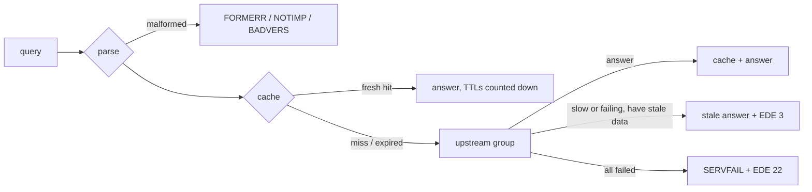

# Running TelltaleDNS

> **Status:** early development. TelltaleDNS resolves queries over UDP and TCP through plain or encrypted upstreams (`udp://`, `tcp://`, `tls://` DoT, `https://` DoH over HTTP/2), with caching, failover, and serve-stale. Filtering and the web UI arrive in the next milestones (`spec/10-roadmap-and-tasks.md`).

## Start
```sh
telltale run                         # uses $TELLTALE_CONFIG, else /etc/telltale/telltale.toml, else defaults
telltale run -c telltale.toml        # explicit config file(s); later files override earlier ones
```
A minimal working config:
```toml
[[listen]]
proto = "udp"
addr = "127.0.0.1:5300"

[[listen]]
proto = "tcp"
addr = "127.0.0.1:5300"

[[upstream]]
name = "cloudflare"
url = "udp://1.1.1.1"

[[upstream]]
name = "quad9"
url = "udp://9.9.9.9"

[[upstream_group]]
name = "default"          # queries that match no route use this group
members = ["cloudflare", "quad9"]
strategy = "fastest"      # failover | round_robin | weighted | fastest | parallel
```
```sh
telltale run -c dev.toml
dig @127.0.0.1 -p 5300 example.com
```
Defaults without `[[listen]]`: UDP and TCP port 53 on `0.0.0.0` and `[::]`, with one worker thread per available CPU (container CPU limits are respected). Ports below 1024 need root or `CAP_NET_BIND_SERVICE`. DoT, DoH, and DoQ *listeners* are accepted in config but skipped with a warning.

## Container image
`ghcr.io/paimonsoror/telltale:edge` is built from every commit on `main` for `linux/amd64`, `linux/arm64` (Raspberry Pi 3/4/5 with a 64-bit OS), and `linux/arm/v7` (32-bit Pi OS). It contains one static binary, CA certificates, and time-zone data, about 3 MiB compressed, with no shell. It runs as user `65532:65532`. Versioned tags (`:1`, `:1.2.3`) start with the first release.
```sh
docker run -d --name telltale --restart unless-stopped \
  --read-only --cap-drop ALL --security-opt no-new-privileges \
  -p 53:53/udp -p 53:53/tcp -p 9153:9153 \
  -v "$PWD/telltale.toml:/etc/telltale/telltale.toml:ro" \
  -v telltale-data:/var/lib/telltale \
  ghcr.io/paimonsoror/telltale:edge
```
- The config is read from `/etc/telltale/telltale.toml` when it exists; otherwise the built-in defaults apply. `/var/lib/telltale` is the only path written to.
- With `-p` (bridge networking), port 53 works with every capability dropped: Docker lets unprivileged users bind low ports inside the container's own network namespace.
- With `--network host` (useful on a Pi, so the logs show real client addresses), that exception doesn't apply. Let unprivileged users bind port 53 on the host:
  ```sh
  echo 'net.ipv4.ip_unprivileged_port_start=53' | sudo tee /etc/sysctl.d/50-telltale.conf && sudo sysctl --system
  ```
  Alternatively, run the container as root with only that one capability: `--user 0:0 --cap-drop ALL --cap-add NET_BIND_SERVICE`. Adding `NET_BIND_SERVICE` while running as `65532` doesn't work, because Docker doesn't pass added capabilities to non-root users.
- Reload with `docker kill -s HUP telltale`; stop with `docker stop` (a graceful drain, see [Stop](#stop)).

Build it yourself with `docker buildx build -t telltale:dev .` (add `--platform linux/amd64,linux/arm64,linux/arm/v7` for all three). The build cross-compiles, so it doesn't need QEMU.

## Upstream presets
Instead of looking up addresses, start from a preset:
```sh
telltale presets list                                   # Cloudflare, Google, Quad9, AdGuard, Mullvad, Control D, NextDNS, ...
telltale presets show quad9 --proto tls,https --group default >> telltale.toml
telltale presets show nextdns --param profile=abc123    # templated presets need your account ID
```
`show` prints explicit `[[upstream]]` entries plus a `fastest` group. Your config always lists exactly what's used and never depends on the catalog, which only helps you write it. The catalog covers every Pi-hole preset plus the common encrypted resolvers; a nightly job checks that every entry still answers. DoQ (`quic://`) endpoints are listed but skipped until DoQ support lands.

## Encrypted upstreams
```toml
[[upstream]]
name = "cloudflare-dot"
url = "tls://1.1.1.1"                       # DNS over TLS, port 853
tls_server_name = "cloudflare-dns.com"      # name on the certificate

[[upstream]]
name = "quad9-doh"
url = "https://dns.quad9.net/dns-query"     # DNS over HTTPS (HTTP/2)
bootstrap = ["9.9.9.9", "149.112.112.112"]  # how to look up dns.quad9.net itself
```
- Certificates are verified against the built-in Mozilla root set, so no CA files are needed, even in a minimal container. `tls_insecure_skip_verify = true` turns verification off (a warning is logged; don't use it on untrusted networks).
- **Hostname upstreams** are looked up through `bootstrap` servers, or the system resolvers from `/etc/resolv.conf` when `bootstrap` is empty (never through TelltaleDNS itself), and the result is cached for its TTL. To skip the lookup, put the IP in the URL and set `tls_server_name`.
- Connections are kept open and reused: many queries share one DoT connection (`pool_size`, default 4; closed after `idle_timeout_ms`, default 30 s), and DoH multiplexes every query over a single HTTP/2 connection.
- Not yet supported (startup error if set): `spki_pins`, `proxy`, `ecs` other than `"strip"`, `http_version = "3"`.

## How a query is answered

- **Cache:** answers are cached for their TTL (clamped by `[cache] min_ttl`/`max_ttl`). Negative answers are cached when the upstream includes an SOA. SERVFAIL is cached for 5 seconds. Hot entries are refreshed in the background just before they expire.
- **Upstreams:** if an upstream is slow, the next one is tried *in parallel* rather than after a timeout, and the first good answer wins. An upstream that fails 3 times in a row (or more than half the time) is benched for 10 seconds, doubling up to 5 minutes, then probed again. Identical concurrent questions share one upstream request.
- **Serve-stale:** if upstreams don't answer within 1.8 s (`[cache] stale_answer_client_timeout_ms`) and an expired answer is still in the cache (up to a day old by default), it's served with TTL 30 and Extended DNS Error 3 ("Stale Answer"), while the refresh continues in the background.
- **Privacy:** queries to upstreams carry a fresh random ID and source port, and none of the client's EDNS options (no client subnet, cookies, or MAC addresses are forwarded).
- **Loop protection:** outbound queries carry a random per-process tag. If one comes back to us (an upstream that forwards to TelltaleDNS), it's dropped and an error is logged instead of looping forever.

## Local records
Names on your network, answered by TelltaleDNS itself (authoritatively, before cache and upstreams):
```toml
[[record]]
name = "nas.home.arpa"
type = "A"                      # A, AAAA, CNAME, PTR, TXT, MX, SRV
value = "192.168.1.10"

[[record]]
name = "*.dev.home.arpa"        # wildcard: every name below dev.home.arpa
type = "A"
value = "192.168.1.20"

[[record]]
name = "_sip._udp.home.arpa"
type = "SRV"
value = "0 5 5060 pbx.home.arpa" # priority weight port target (MX: "preference exchange")

[local]
hosts_files = ["/etc/telltale/hosts"]   # "IP name [alias...]" lines
auto_ptr = true                          # reverse lookups for every A/AAAA (default)
default_ttl = 300
```
- A name with no record of the requested type gets an empty authoritative answer (NODATA). Names that aren't local go to the upstreams as usual.
- CNAMEs are followed within local data; if the target is elsewhere, the client follows it.
- Hosts files skip `0.0.0.0`, `::`, and loopback entries (those are blocklists or this machine, not network hosts).
- `telltale config check` validates record values and reads the hosts files.

## Filter lists
> **Status:** lists are downloaded, compiled, and **enforced** per client group, including names reached through a CNAME.

```toml
[[list]]
name = "hagezi-pro"                     # ID: lowercase letters, digits, - and _
url = "https://raw.githubusercontent.com/hagezi/dns-blocklists/main/adblock/pro.txt"

[[list]]
name = "family-allow"
kind = "allow"                          # block (default) or allow
match = "exact"                         # subtree (default: the name and everything below it) or exact
path = "/etc/telltale/allow.txt"        # a local file, re-read on every refresh

[[list]]
name = "manual"
rules = ["||ads.example.com^", "@@||cdn.example.com^"]

[filter]
refresh_secs = 86400                    # every 24 h (per-list `refresh_secs` overrides; minimum 900)
fetch_concurrency = 4
fetch_timeout_secs = 120                # per attempt, including the download
fetch_retries = 3                       # network errors, HTTP 5xx, and 429 are retried with backoff
max_list_bytes = "64MiB"                # per-list `max_bytes` overrides
compile_threads = 0                     # 0 = auto (first compile: half the cores, 1-4; recompiles: 1)
compile_memory = "128MiB"               # sort budget before spilling to disk
```
- **Downloads are polite:** after the first download, a refresh sends `If-None-Match`/`If-Modified-Since`, so an unchanged list costs one small request. Redirects are followed, except from `https` to `http`.
- **A failed refresh never loses a list.** The last good copy stays in use. A failing list is retried after 5 minutes, then 10, 20, and so on up to hourly, instead of waiting a whole day. Responses that can't be a list are rejected, such as an empty body or an HTML page from a captive portal.
- Lists are stored compressed in `<data_dir>/lists/` (`<name>.src.zst` plus `<name>.meta.json`). Removing a list from the config deletes its files; `enabled = false` keeps them.
- List hostnames are looked up through the system resolvers (minus TelltaleDNS's own listeners). If the system resolver *is* TelltaleDNS, the lookup goes through it, which is safe because DNS is answering before downloads start.
- Downloads run in the background. DNS starts and answers without waiting for them, and a failing download never affects answers.
- Adding, removing, or editing lists applies on reload (`SIGHUP`). `[filter]` changes need a restart.
- To refresh every list now instead of waiting for `refresh_secs` (like `pihole -g`), send `SIGUSR1` (`kill -USR1 <pid>`, or `docker kill -s USR1 telltale`). Unchanged lists cost one conditional request each, and the filter is recompiled only if something changed.

Fetch now, outside the server (same config and data directory):
```sh
telltale lists fetch -c telltale.toml
# list                     result            bytes      lines  note
# hagezi-pro               updated         5049934     227434
# manual                   unchanged            39          2
```
### List syntax
Every common format works, and formats can be mixed in one list:

| Line | Meaning |
|---|---|
| `0.0.0.0 ads.example.com` (any IP, several names allowed) | hosts file: block `ads.example.com` (`localhost` and similar lines are skipped) |
| `ads.example.com` | the name and everything below it (or only the name, with `match = "exact"`) |
| `*.example.com` or `.example.com` | everything below `example.com`, but not `example.com` itself |
| `\|\|ads.example.com^` | AdBlock: the name and everything below it |
| `\|ads.example.com^` | AdBlock: only the name |
| `@@\|\|cdn.example.com^` | exception: allow, even in a blocklist |
| `\|\|ads.example.com^$important` | wins over ordinary allow rules |
| `\|\|example.com^$dnstype=AAAA\|~A` | only for these query types (`~` excludes) |
| `\|\|example.com^$client=192.168.1.0/24\|'Kids tablet'` | only for these clients (`~` excludes) |
| `\|\|example.com^$denyallow=mail.example.com` | block `example.com` except these names below it |
| `\|\|ads.example.com^$badfilter` | cancels the same rule without `$badfilter` |
| `/^ad[0-9]+\./` | AdBlock regex |
| `(^\|\.)doubleclick\.net$` | Pi-hole regex; add `;querytype=A,AAAA` (or `=!A` to exclude) or `;invert` |
| `# ...`, `! ...`, `[Adblock Plus 2.0]` | comments |

Names are lowercased, internationalized names are converted to punycode, and a trailing dot is ignored. Regexes match the lowercase query name and can't use backreferences or lookaround: the regex engine runs in linear time, so a pattern can't stall a query.

Rules that only make sense in a browser are counted as *unsupported* and skipped, not treated as errors: cosmetic rules (`##`), URL paths (`||example.com/ads.js`), wildcards inside names (`ads*.example.com`), IP rules (`||192.0.2.1^`, which filter answers rather than names), and modifiers such as `$third-party` or `$ctag`. A rule with a modifier TelltaleDNS doesn't support is skipped entirely. Applying it without the modifier would block more than the list author intended.

See what a list contains and which lines were skipped:
```sh
telltale lists check -c telltale.toml
# adguard-dns: 179561 lines, 177414 rules, 1658 comments, 0 ignored, 489 unsupported, 0 invalid
#   L79 unsupported: IP address rule (response IP filtering): ||194.63.143.96^
telltale lists check -c telltale.toml --list manual --rules   # every rule in canonical form
```
It exits non-zero if any list has invalid lines.

### Compiling
Whenever a list's content changes, a list is added or removed, or a list's `kind`/`match` changes, TelltaleDNS compiles every enabled list into a new **filter snapshot** in `<data_dir>/snapshots/<version>/`. The three newest snapshots are kept. A restart with unchanged lists reuses the newest snapshot instead of compiling again, and a failed compile keeps the previous one.

- Compiling runs in the background at the lowest CPU priority (`SCHED_IDLE` on Linux), and never pauses or locks query handling. The new snapshot replaces the old one atomically: queries in flight finish with the old one, and the old one is freed on a background thread.
- Thread count, `[filter] compile_threads`: the default, `0`, uses half the cores (between 1 and 4, so 2 on a Pi 4) when nothing is filtering yet, so blocking starts quickly on a first start. Once a filter is serving, a recompile (list refresh, reload) uses **one** thread: it takes longer, but nobody waits for it, and more threads compete with queries for cores and memory bandwidth even at the lowest priority. Set a number to use it for every compile.
- Memory stays bounded. List entries are sorted within `[filter] compile_memory` (default `"128MiB"`), and anything beyond that spills to temporary files in the snapshot directory. Each list's text is read only while it's being parsed.
- Size and speed: about 9 bytes per blocked name. On a Raspberry Pi 4, 2 million names compile in about 6.4 s on 2 threads (the default first compile), 11.6 s on 1 (the default recompile), and 4.7 s on 3. A laptop does 2.7M names in about 2.7 s.

```sh
telltale lists compile -c telltale.toml     # compile now and show per-list numbers
# snapshot 1 in /var/lib/telltale/snapshots/1
#   names 2597518 (subtree 2597518, exact 0, subdomains 0), regexes 0, modifier rules 0, list sets 7, $badfilter removed 0
#   8.98 bytes/name; 4.56s total (parse 2.03s, merge 2.49s, tables 9.10ms) on 1 thread(s); 0 sort runs spilled
#   hagezi-tif               entries   2376001  unique   2213895  unsupported      0  invalid      0
#   hagezi-pro               entries    227420  unique    102069  unsupported      0  invalid      0
#   oisd-big                 entries    244348  unique     55809  unsupported      0  invalid      0
```
`unique` counts the names no other list has. A list with few unique names adds little beyond your other lists.

### Blocking
A query is checked against the filter after local records and before the cache, so a blocked name never reaches an upstream:
```
$ dig @192.168.1.53 ads.example.com
;; ->>HEADER<<- opcode: QUERY, status: NOERROR
; EDE: 15 (Blocked): (blocked by list hagezi-pro)
ads.example.com.   60   IN   A   0.0.0.0
```
How blocked names are answered is set per group (the client's highest-priority group decides):

```toml
[[group]]
name = "kids"
block_mode = "null_ip"      # default: A → 0.0.0.0, AAAA → ::, other types → no records
                            # or "nxdomain", "nodata", "refused", "custom_ip"
block_ips = ["192.168.1.2", "fd00::2"]   # for "custom_ip", e.g. a "blocked" page
block_ttl = 60              # how long clients may cache the block
ede = "filtered"            # "blocked" (EDE 15, default) or "filtered" (EDE 17: parental controls)
ede_text = true             # name the list in the EDE text (set false to hide list names)
```
`null_ip` is the default, as in Pi-hole and Technitium. Apps treat it as "unreachable" and give up quickly, while NXDOMAIN makes some apps retry or fall back to another resolver.

**CNAME inspection:** if an answer leads through a CNAME to a blocked name (`www.microsoft.com` → `…edgekey.net` → `….akamaiedge.net`), the answer is replaced with the client's block answer, with EDE text `CNAME target blocked by list …`. This also applies to answers served from the cache, which is shared by every group, so one group's policy never leaks into another's.

**Pause:** blocking can be paused for everyone or for one group, for a set time, and resumes on its own. The control is part of the API (milestone M3); the metric `telltale_filter_paused_until_seconds{group}` shows active pauses.
When rules disagree, the most important one wins:

| Wins | Rule | Example |
|---|---|---|
| 1 | important allow | `@@\|\|cdn.example.com^$important` |
| 2 | important block | `\|\|ads.example.com^$important` |
| 3 | allow (allowlists, `@@` rules) | `@@\|\|cdn.example.com^`, or a `kind = "allow"` list |
| 4 | block | everything else |

Among rules of the same kind, the one reported is an exact-name rule first, then the longest matching domain, then a regex, then the list listed first in the config.

Lookups take well under a microsecond: about 0.3 µs typically and under 1 µs at p99 on an x86 server with 2.6M blocked names. They use an in-memory index built from the snapshot (about 10 bytes per name, on top of the snapshot's 9). A new snapshot is served the moment it's loaded, and the index is swapped in about a second later, without pausing queries. Memory with HaGeZi Pro + TIF + OISD big + StevenBlack + AdGuard (2.7M names): about 85 MiB in total; HaGeZi Pro alone (227k names): about 10 MiB.

Metrics: `telltale_queries_total{status="blocked"}` (including CNAME blocks), `telltale_filter_paused_until_seconds{group}`, `telltale_filter_lookup_index_bytes` (0 while the index is being built), `telltale_filter_snapshot_version`, `telltale_filter_rules`, `telltale_filter_compile_seconds`, `telltale_list_entries{list}`, `telltale_list_source_bytes`, `telltale_list_last_success_timestamp_seconds`, `telltale_list_last_change_timestamp_seconds`, and `telltale_list_fetch_consecutive_failures`, each labeled `{list}`. To alert on a list that has failed for two days:
```
time() - telltale_list_last_success_timestamp_seconds > 172800
```

## Groups and devices
Decide which lists apply to which devices:
```toml
[[group]]
name = "kids"
lists = ["hagezi-pro", "family-extra"]   # omit `lists` to use every list
priority = 10                            # highest-priority group's settings win

[[group]]
name = "default"                         # optional: what unknown devices get
lists = ["hagezi-pro"]                   # (without it, unknown devices get every list)

[[client]]
name = "Kids tablet"
match = ["aa:bb:cc:dd:ee:01", "192.168.1.50", "id:kids-tablet"]
groups = ["kids"]

[[client]]
name = "Office"
match = ["10.0.5.0/24"]                  # groups default to ["default"]
```
- A device in several groups gets every list of all of them. Other settings, such as block mode (T2.6), come from its highest-priority group.
- **How a query's device is recognized,** first match wins: client ID (`id:…`, from the DoH URL path `/dns-query/<id>` or the DoT name `<id>.dns.example.com`, once those listeners land) → MAC address, from a trusted router's EDNS option or from the kernel neighbor table → exact IP → the most specific CIDR → `default`.
- **MAC addresses** survive DHCP changes and IPv6 privacy addresses, which makes them the most dependable key for a home network. TelltaleDNS reads the kernel's neighbor table (ARP and IPv6 NDP) every 60 s (`[clients] neighbor_refresh_secs`). That only sees real devices with host networking (as on a Pi). In a container's bridge network, every query appears to come from the gateway.
- If your router forwards queries with dnsmasq's `add-mac`, trust it explicitly. Any device could send that option and impersonate another, so it's ignored by default:
  ```toml
  [clients]
  trust_edns_mac_from = ["192.168.1.1/32"]
  ```
- `$client=` rules match the device's name (`$client='Kids tablet'`), its client ID, or its IP or CIDR.
- `[[route]] match_group = ["kids"]` sends a group's queries to its own upstreams (for example, a family-filtering resolver).
- Changes apply on reload (`SIGHUP`). Metric: `telltale_neighbors` (entries in the neighbor table).

## Why was it blocked? (explain)
`telltale explain` shows what happens to a name for a given device, and why. It lists:
- who the device is recognized as, and its groups;
- every rule in every list that matches, with its file line, in precedence order;
- which rule decides;
- where the query would be forwarded.

```sh
telltale explain ad.doubleclick.net --client 192.168.1.50 -c telltale.toml
# ad.doubleclick.net A from 192.168.1.50
# client   tablet (identified by ip); groups: kids
# outcome  ALLOWED: allowed by list family-allow; resolved normally
# rules    snapshot 1, in precedence order (* decides, - list not used by this client)
#   * allow  family-allow         doubleclick.net (and subdomains)
#              family-allow:1  @@||doubleclick.net^
#   - block  stevenblack          ad.doubleclick.net (and subdomains)
#              stevenblack:7102  0.0.0.0 ad.doubleclick.net
# route    upstream group default (default)
```
- Options: `-t AAAA` for another query type, `--mac aa:bb:cc:dd:ee:ff` or `--client-id` to explain for a device recognized that way, and `--json` for the same data as JSON (the format the API's `GET /api/v1/explain` will return).
- `-` marks rules from lists the device's groups don't use, so you can see what another group would get. `!` after `allow`/`block` marks `$important` rules.
- It reads the config and the data directory (the newest compiled snapshot and the stored lists), so it works whether or not the server is running. A server that hasn't loaded the newest snapshot yet may still be using the previous one.
- Line numbers come from the stored copy of each list. If a list was downloaded again after the snapshot was compiled, the output says so.
- Explain covers the query name only. CNAME targets in an upstream answer are checked too when the server answers (see [Blocking](#blocking)); explain a target name to see its rules.

## Who can query, and how often
```toml
[access]
# Default: private ranges, CGNAT/Tailscale (100.64/10), link-local, loopback. Everyone else: REFUSED.
allowed_networks = ["192.168.0.0/16", "fd00::/8", "127.0.0.0/8"]

[ratelimit]
queries = 1000          # per client per window (bursts allowed up to this)
window_secs = 60
action = "refused"      # or "drop"
exempt = ["127.0.0.0/8", "::1/128"]
ipv6_prefix = 64        # a device's rotating IPv6 privacy addresses share one budget
```
TelltaleDNS is never an open resolver by default. If you widen `allowed_networks` to everything, a warning is logged at startup.

## Special names
Handled before anything else (each can be turned off under `[special]`):

| Name | Answer | Why |
|---|---|---|
| `localhost`, `*.localhost` | 127.0.0.1 / ::1 | RFC 6761 |
| `*.invalid` | NXDOMAIN | RFC 6761 |
| `use-application-dns.net` | NXDOMAIN | stops Firefox from silently switching to its own DoH (`block_firefox_canary`) |
| CHAOS class (`version.bind`, …) | REFUSED | no fingerprinting (`refuse_chaos`) |
| reverse lookups for private IPs | NXDOMAIN | never leaks your LAN layout to public resolvers, unless a local record or a `[[route]]` covers it (`private_ptr_nxdomain`) |

`.local` names are passed through unchanged (many Active Directory domains use them; route them with `[[route]]`).

## Routing (conditional forwarding)
```toml
[[upstream]]
name = "home-router"
url = "udp://192.168.1.1"

[[upstream_group]]
name = "lan"
members = ["home-router"]

[[route]]
match_suffix = ["home.arpa", "168.192.in-addr.arpa"]   # local names and reverse lookups
upstream_group = "lan"
```
The longest matching suffix wins; routes can also match `match_qtype = ["PTR"]`.

## Monitoring
An HTTP listener (default `0.0.0.0:9153`, set with `[telemetry.metrics] listen`) serves:

| Path | Use |
|---|---|
| `/metrics` | Prometheus scrape |
| `/livez` | the process is alive (Kubernetes liveness) |
| `/healthz` | the process is healthy |
| `/readyz` | 200 once every DNS listener is bound, 503 while starting or shutting down (Kubernetes readiness) |

Until API authentication lands, this listener answers only clients inside `[access] allowed_networks`.

Main metrics:

| Metric | What it tells you |
|---|---|
| `telltale_queries_total{proto,status}` | queries by outcome: `cached`, `forwarded`, `stale`, `local`, `special`, `refused`, `rate_limited`, `malformed`, `servfail`, `dropped` |
| `telltale_query_duration_seconds{path}` | latency histogram per path (`cache`, `upstream`, `local`, `synthesized`) |
| `telltale_responses_total{rcode}`, `telltale_queries_by_qtype_total{qtype}` | answers by RCODE; queries by type |
| `telltale_cache_*` | hits, misses, stale answers served, entries, bytes, evictions |
| `telltale_upstream_requests_total`, `_failures_total`, `_breaker_state`, `_latency_ewma_seconds` | per-upstream health |
| `telltale_udp_*`, `telltale_tcp_*` | listener counters |
| `telltale_resident_memory_bytes`, `telltale_uptime_seconds`, `telltale_build_info` | process |

Counters are kept per thread and summed on scrape, so recording never slows a query or allocates memory.

## Reload without restarting
Edit the config file, then send `SIGHUP` (`kill -HUP <pid>`, or `docker kill -s HUP telltale`):
- The whole config is validated first. If anything is wrong, the errors are logged and the **previous configuration keeps serving**.
- Applied immediately, with no dropped queries: upstreams, groups, routes, local records and hosts files, `[access]`, `[ratelimit]`, `[special]`, and `[[listen]]` (new listeners are bound before removed ones are closed).
- Applied at the next restart (a warning names them): `[cache]`, `[telemetry]`, `[node]`. The cache is kept across reloads, so warm answers aren't lost.
- Upstream health starts fresh after a reload and is re-learned within a few queries.

## Stop
`SIGTERM` or `SIGINT` (Ctrl-C) shuts down gracefully:
1. `/readyz` turns 503, so load balancers stop sending new queries.
2. TCP listeners stop accepting and finish the queries already received.
3. Upstream lookups still in flight get up to 3 seconds to complete and reply.
4. UDP workers stop.

In Kubernetes, pair this with a short `preStop` sleep so endpoints are removed before the drain begins (the Helm chart will set this).

## Logging
Logs go to stderr. Set the level with `TELLTALE_LOG` (`error`, `warn`, `info` (default), `debug`, `trace`).

## Error responses
| Query | Response |
|---|---|
| Opcode other than QUERY | NOTIMP |
| Malformed (bad name, QDCOUNT ≠ 1, bad OPT, …) | FORMERR |
| EDNS version > 0 | BADVERS with an OPT record of version 0 (RFC 6891) |
| No upstream group applies (none configured) | REFUSED + EDE 14 "no upstreams configured" |
| Shorter than a DNS header, or a response (QR=1) | Silently dropped |

Responses larger than the client's UDP limit are truncated (TC=1) so the client retries over TCP. TCP follows RFC 7766: pipelined queries, answers in completion order, a 10-second idle timeout, at most 64 outstanding queries per connection, and at most 1024 connections.
