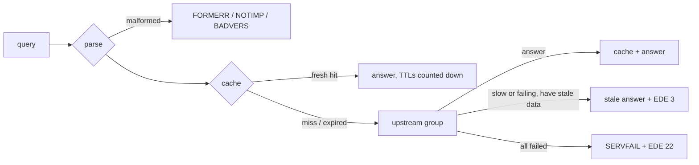

# Running TelltaleDNS

> **Status:** early development. TelltaleDNS resolves queries over UDP and TCP through plain-DNS upstreams (`udp://`, `tcp://`), with caching, failover, and serve-stale. Encrypted upstreams (DoT/DoH), filtering, and the web UI arrive in the next milestones (`spec/10-roadmap-and-tasks.md`).

## Start
```sh
telltale run                         # uses $TELLTALE_CONFIG, else /etc/telltale/telltale.toml, else defaults
telltale run -c telltale.toml        # explicit config file(s); later files override earlier ones
```
A minimal working config:
```toml
[[listen]]
proto = "udp"
addr = "127.0.0.1:5300"

[[listen]]
proto = "tcp"
addr = "127.0.0.1:5300"

[[upstream]]
name = "cloudflare"
url = "udp://1.1.1.1"

[[upstream]]
name = "quad9"
url = "udp://9.9.9.9"

[[upstream_group]]
name = "default"          # queries that match no route use this group
members = ["cloudflare", "quad9"]
strategy = "fastest"      # failover | round_robin | weighted | fastest | parallel
```
```sh
telltale run -c dev.toml
dig @127.0.0.1 -p 5300 example.com
```
Defaults without `[[listen]]`: UDP and TCP port 53 on `0.0.0.0` and `[::]`, with one worker thread per available CPU (container CPU limits are respected). Ports below 1024 need root or `CAP_NET_BIND_SERVICE`. Upstreams must be IP addresses for now; hostnames (with bootstrap resolution) and `tls://` / `https://` come next. DoT, DoH, and DoQ *listeners* are accepted in config but skipped with a warning.

## How a query is answered

- **Cache:** answers are cached for their TTL (clamped by `[cache] min_ttl`/`max_ttl`). Negative answers are cached when the upstream includes an SOA. SERVFAIL is cached for 5 seconds. Hot entries are refreshed in the background just before they expire.
- **Upstreams:** if an upstream is slow, the next one is tried *in parallel* rather than after a timeout, and the first good answer wins. An upstream that fails 3 times in a row (or more than half the time) is benched for 10 seconds, doubling up to 5 minutes, then probed again. Identical concurrent questions share one upstream request.
- **Serve-stale:** if upstreams don't answer within 1.8 s (`[cache] stale_answer_client_timeout_ms`) and an expired answer is still in the cache (up to a day old by default), it's served with TTL 30 and Extended DNS Error 3 ("Stale Answer"), while the refresh continues in the background.
- **Privacy:** queries to upstreams carry a fresh random ID and source port, and none of the client's EDNS options (no client subnet, cookies, or MAC addresses are forwarded).

## Routing (conditional forwarding)
```toml
[[upstream]]
name = "home-router"
url = "udp://192.168.1.1"

[[upstream_group]]
name = "lan"
members = ["home-router"]

[[route]]
match_suffix = ["home.arpa", "168.192.in-addr.arpa"]   # local names and reverse lookups
upstream_group = "lan"
```
The longest matching suffix wins; routes can also match `match_qtype = ["PTR"]`.

## Stop
`SIGTERM` or `SIGINT` (Ctrl-C) stops the listeners and exits. Full connection draining and hot reload come later (OPS-007, OPS-009).

## Logging
Logs go to stderr. Set the level with `TELLTALE_LOG` (`error`, `warn`, `info` (default), `debug`, `trace`).

## Error responses
| Query | Response |
|---|---|
| Opcode other than QUERY | NOTIMP |
| Malformed (bad name, QDCOUNT ≠ 1, bad OPT, …) | FORMERR |
| EDNS version > 0 | BADVERS with an OPT record of version 0 (RFC 6891) |
| No upstream group applies (none configured) | REFUSED + EDE 14 "no upstreams configured" |
| Shorter than a DNS header, or a response (QR=1) | Silently dropped |

Responses larger than the client's UDP limit are truncated (TC=1) so the client retries over TCP. TCP follows RFC 7766: pipelined queries, answers in completion order, a 10-second idle timeout, at most 64 outstanding queries per connection, and at most 1024 connections.
